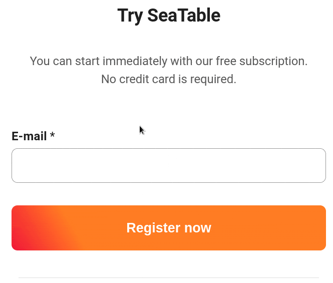

Вы не получили письмо с подтверждением регистрации в SeaTable? Не стоит беспокоиться! Просто выполните следующие шаги, и вскоре вы сможете продолжить регистрацию.

## Успешная регистрация

Если в процессе регистрации вы **не** получили сообщение об ошибке, на указанный вами адрес электронной почты обычно отправляется письмо, подтверждающее вашу регистрацию.

## Возможные решения

Если вы **не** получили письмо, проверьте следующие варианты:

1. Будьте терпеливы: в редких случаях отправка письма с подтверждением может **задержаться** на некоторое время.
2. Проверьте **папку "Спам"**, вкладку " **Реклама"**, если необходимо, и **корзину**. Возможно, письмо попало туда.
3. Если **ни** один из этих шагов **не** увенчался успехом, вы можете зарегистрироваться еще раз [здесь](), указав свой адрес электронной почты, после чего получите **новое** письмо с подтверждением.
