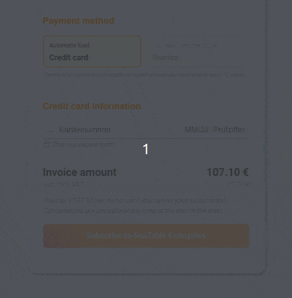

When you sign up for a paid SeaTable subscription, you are typically required to provide additional authentication in the form of 3D Secure authentication in addition to providing your credit card information. 3D Secure is an additional authentication layer for credit card transactions that is supposed to make payments on the Internet more secure. This security mechanic causes problems time and again, which is why the desired payment cannot be made successfully and you cannot switch to SeaTable Plus or Enterprise.

## What problems can occur with 3D Secure?

Typically, payments to SeaTable are made without difficulty. You select the subscription you want in Team administration, specify the bill recipient, and complete the order with your credit card information.  
Usually, a few seconds later, a new form appears to confirm 3D Secure authentication, which has been reloaded from your bank. The methods for confirming 3D Secure differ depending on the bank. Basically, however, this step must be performed in order for the payment to SeaTable to be authorized and accepted for future payments.

There are always problems with this reloading of the 3D Secure check. Sometimes this new form does not appear, sometimes the screen goes white and sometimes it is accidentally clicked away.

## What can you do?

We cannot give you general advice, because the problems are too diverse and always depend on your browser, operating system, and antivirus or protection software, if any. Try a different browser or credit card. Be attentive to whether your browser or operating system may give you a hint as to why something is not happening right now.

Basically, however, we can say that the 3D Secure verification is necessary to complete a paid subscription. So, if it, the payment or authentication does not work, just reload the page and try again.

If you are still stuck, please use the [contact options]() and get in [touch]() with us. We will try to help you further.
