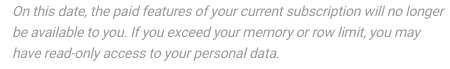

¿Sólo tienes acceso de lectura a tus datos y ya no puedes editarlos? No se preocupe, sus datos están a salvo. Probablemente sólo ha alcanzado sus **límites**, que están a su disposición en su **suscripción actual a SeaTable**.



En nuestra [página de precios]() encontrará un resumen detallado de todos los **paquetes de suscripción** disponibles, así como de las funciones, opciones y límites de que dispone con ellos.



## ¿Cómo puedo volver a editar mis datos?

Para poder seguir editando completamente tus datos, debes **cambiar a** un **paquete de suscripción** que te conceda **límites más amplios** que tu suscripción actual. Puedes encontrar los pasos necesarios en detalle en este [artículo de ayuda sobre cómo actualizar tu cuenta]().

También puedes borrar parte de tus datos hasta que vuelvas a estar por debajo de tus límites actuales.

## Cambio y límites de suscripción

Tenga también en cuenta que sus **límites** también pueden alcanzarse si cambia su suscripción a un **paquete de suscripción más pequeño**. Si, tras cambiar de **Enterprise a Plus** o de **Plus a Free** , el volumen de sus datos supera los límites incluidos en la nueva suscripción contratada, es posible que sólo tenga **acceso de lectura a** sus datos. En consecuencia, ya no podrán procesar tus datos hasta que vuelvas a cambiar a un paquete de suscripción más **amplio** o borres parte de tus datos.

Por lo tanto, **antes de** cambiar a un paquete de suscripción inferior, asegúrese de que sus datos **no** superan los límites del nuevo paquete reservado. También recibirá el **aviso** correspondiente de SeaTable antes de confirmar un cambio de suscripción en la administración del equipo.

