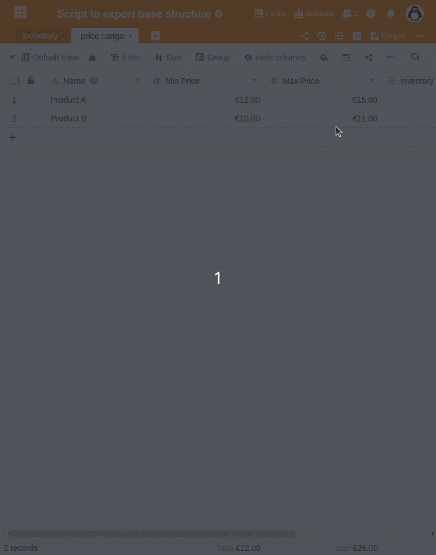

En el siguiente artículo encontrarás un script en Python que te permite mostrar toda la **estructura de tablas y columnas de una base** como texto plano. Esta estructura ayuda, por ejemplo, al soporte de usuarios a entender cuando haces una pregunta en el foro.

## Introducción y ejecución del script



1. Abra la **base** donde tiene el problema.
2. Haga clic en  en la cabecera de la base.
3. Cree un **nuevo script** y seleccione **Python**.
4. Copie el siguiente **código** en el panel izquierdo.

```
from seatable_api import Base, context
server_url = context.server_url
api_token = context.api_token
base = Base(api_token, server_url)
base.auth()
metadata = base.get_metadata()

print("--- COMPLETE BASE STRUCTURE WITH ALL BASES AND COLUMNS ---")
for table in metadata['tables']:
  print('.')
  print("Table: "+table['name']+" (ID: "+table['_id']+")")
  for column in table['columns']:
    link_target = ""
    if column['type'] == "link":
      link_target = " --> "+column['data']['other_table_id']
      if column['data']['other_table_id'] == table['_id']:
        link_target = " --> "+column['data']['table_id']
    print("  --> "+column['name']+" ("+column['type']+link_target+")")

```

8. Confirme con **Ejecutar Script**.

## El resultado del script Python

La salida del script proporciona, por ejemplo, el siguiente resultado, que luego se copia y se utiliza para un **Entrada en el foro** o para un [Ticket de asistencia](https://seatable.io/es/docs/teamverwaltung/ein-support-ticket-eroeffnen/) puede utilizar.

```
--- COMPLETE BASE STRUCTURE WITH ALL BASES AND COLUMNS ---
.
Table: inventory (ID: 0000)
--> Name (text)
--> Link to other table (link --> 5H74)
--> Status (single-select)
--> Collaborator (collaborator)
--> URL of the customer (url)
.
Table: price range (ID: 5H74)
--> Name (text)
--> Min Price (number)
--> Max Price (number)
--> inventory (link --> 0000)

```

## Utilizar la estructura base para una entrada en el Foro comunitario

Si abre un nuevo tema en el [foro SeaTable](https://forum.seatable.io) utilizando el botón **\+ Nuevo tema**, puede insertar su estructura base como **texto preformateado** para ilustrar el problema.


