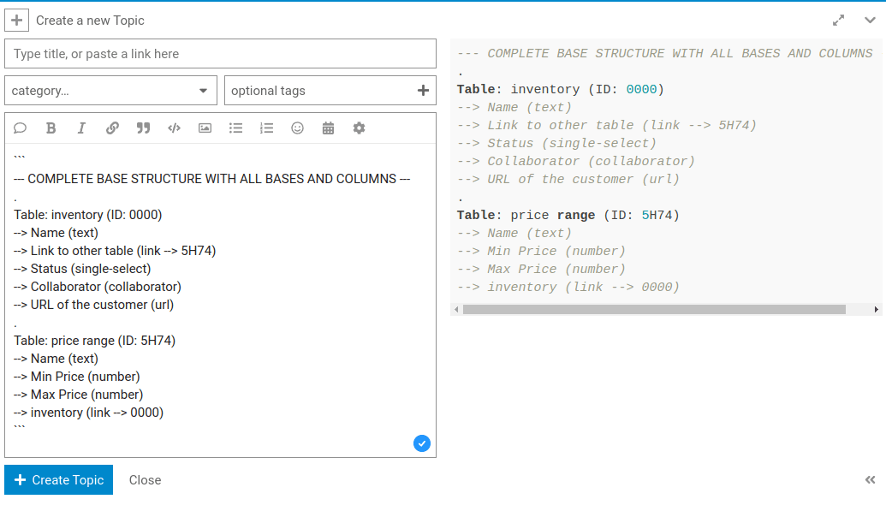

Dans l'article suivant, vous trouverez un script Python qui vous permet d'afficher l'ensemble de la **structure des tableaux et des colonnes d'une base** en texte clair. Cette structure aide par exemple le support utilisateur à comprendre lorsque vous posez une question sur le forum.

## Saisie et exécution du script


1. Ouvrez la **base** dans laquelle vous avez un problème.
2. Cliquez sur  dans l'en-tête de la base.
3. Créez un **nouveau script** et choisissez **Python**.
4. Copiez le **code** suivant dans le volet gauche de la fenêtre.

```
from seatable_api import Base, context
server_url = context.server_url
api_token = context.api_token
base = Base(api_token, server_url)
base.auth()
metadata = base.get_metadata()

print("--- COMPLETE BASE STRUCTURE WITH ALL BASES AND COLUMNS ---")
for table in metadata['tables']:
  print('.')
  print("Table: "+table['name']+" (ID: "+table['_id']+")")
  for column in table['columns']:
    link_target = ""
    if column['type'] == "link":
      link_target = " --> "+column['data']['other_table_id']
      if column['data']['other_table_id'] == table['_id']:
        link_target = " --> "+column['data']['table_id']
    print("  --> "+column['name']+" ("+column['type']+link_target+")")

```

8. Confirmez en cliquant sur **Exécuter le script**.

## Le résultat du script Python

La sortie du script donne par exemple le résultat suivant, que vous pouvez ensuite copier et utiliser pour un **Entrée dans le forum** ou pour un [Billet d'assistance]() peuvent utiliser.

```
--- COMPLETE BASE STRUCTURE WITH ALL BASES AND COLUMNS ---
.
Table: inventory (ID: 0000)
--> Name (text)
--> Link to other table (link --> 5H74)
--> Status (single-select)
--> Collaborator (collaborator)
--> URL of the customer (url)
.
Table: price range (ID: 5H74)
--> Name (text)
--> Min Price (number)
--> Max Price (number)
--> inventory (link --> 0000)

```

## Utiliser la structure de base pour une entrée dans le forum de la communauté

Lorsque vous ouvrez un nouveau sujet dans le [forum SeaTable](https://forum.seatable.com) en cliquant sur le bouton **\+ New Topic**, vous pouvez insérer votre structure de base sous forme de **texte préformaté** afin d'illustrer le problème.


