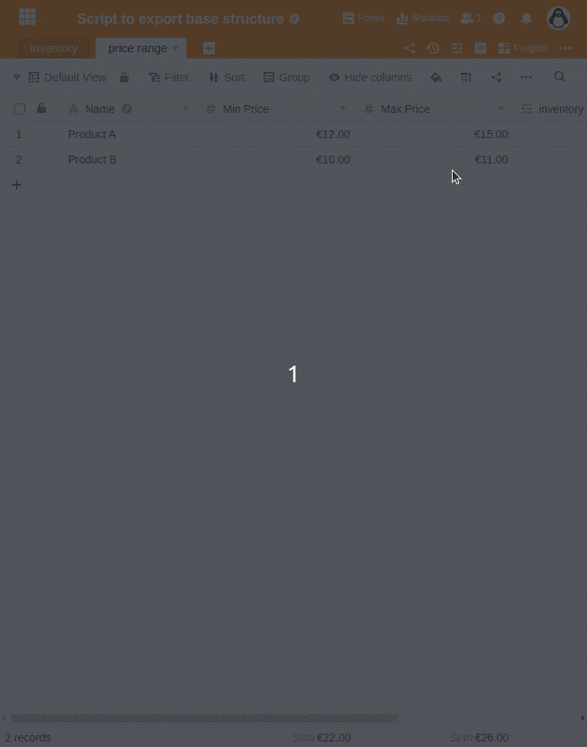
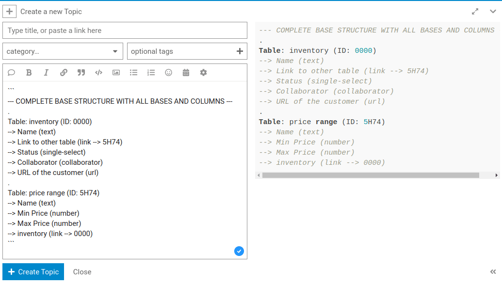

В следующей статье вы найдете сценарий Python, который позволяет вывести всю **структуру таблиц и столбцов базы** в виде обычного текста. Эта структура помогает, например, службе поддержки пользователей понять, когда вы задаете вопрос на форуме.

## Ввод и выполнение сценария



1. Откройте **базу**, где у вас возникла проблема.
2. Щелкните  в заголовке базы.
3. Создайте **новый сценарий** и выберите **Python**.
4. Скопируйте следующий **код** в левую панель.

```
from seatable_api import Base, context
server_url = context.server_url
api_token = context.api_token
base = Base(api_token, server_url)
base.auth()
metadata = base.get_metadata()

print("--- COMPLETE BASE STRUCTURE WITH ALL BASES AND COLUMNS ---")
for table in metadata['tables']:
  print('.')
  print("Table: "+table['name']+" (ID: "+table['_id']+")")
  for column in table['columns']:
    link_target = ""
    if column['type'] == "link":
      link_target = " --> "+column['data']['other_table_id']
      if column['data']['other_table_id'] == table['_id']:
        link_target = " --> "+column['data']['table_id']
    print("  --> "+column['name']+" ("+column['type']+link_target+")")

```

8. Подтвердите команду **Run Script (Выполнить сценарий**).

## Результат выполнения сценария Python

Например, на выходе сценария получается следующий результат, который вы можете скопировать и использовать для **Вход на форум** или для [Билет поддержки]() можно использовать.

```
--- COMPLETE BASE STRUCTURE WITH ALL BASES AND COLUMNS ---
.
Table: inventory (ID: 0000)
--> Name (text)
--> Link to other table (link --> 5H74)
--> Status (single-select)
--> Collaborator (collaborator)
--> URL of the customer (url)
.
Table: price range (ID: 5H74)
--> Name (text)
--> Min Price (number)
--> Max Price (number)
--> inventory (link --> 0000)

```

## Использование базовой структуры для записи на форуме сообщества

Если вы откроете новую тему на [форуме SeaTable](https://forum.seatable.com) с помощью кнопки **\+ Новая тема**, вы можете вставить свою базовую структуру в виде **предварительно отформатированного текста**, чтобы проиллюстрировать проблему.


