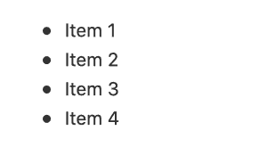

[Markdown](https://en.wikipedia.org/wiki/Markdown) es un lenguaje de marcado muy simplificado que se utiliza para **dar formato al texto**. SeaTable utiliza Markdown en varios lugares para dar formato a textos largos de forma visualmente atractiva.

No es necesario que esté familiarizado con la sintaxis de Markdown. Pero tanto si es la primera vez que utiliza Markdown como si ya tiene experiencia con él, este artículo le ayudará a comprender mejor dónde y cómo utilizar la versión de Markdown de SeaTable.

## Reducción de SeaTable

Actualmente hay cinco áreas en las que puede utilizar la sintaxis Markdown en SeaTable. Éstas son:

- Columnas del tipo de [texto formateado]()
- [Descripciones básicas]()
- Textos de correo electrónico al enviar mediante [automatizaciones]()
- [Formularios web]()
- [Aplicaciones universales]()

En cuanto se utilice Markdown en SeaTable, se le ofrecerá la siguiente máscara de entrada. Por supuesto, puede marcar palabras o bloques de texto como de costumbre y luego seleccionar el formato deseado.


También puede activar directamente el formato Markdown introduciendo determinados caracteres especiales. Simplemente escriba un carácter especial en un campo de entrada de Markdown.  seguido de una palabra. Verás que la almohadilla en la sintaxis Markdown representa un primer título. Así que si sabes qué carácter especial desencadena qué formato, podrás capturar y formatear tus textos mucho más rápido.

Actualmente, sólo puede activar parte del formato con un carácter especial. Puedes averiguar cuáles son en este artículo.



## Formateo de sintaxis en SeaTable mediante caracteres especiales

Actualmente, puede activar las siguientes opciones de sintaxis en SeaTable mediante caracteres especiales.

### Titulares

Una línea que comienza con uno a tres \-seguido de un espacio, da como resultado un carácter **Titular** del primer al tercer nivel.

**Sintaxis Markdown**

\## Cabecera de primer nivel  
\## Cabecera de segundo nivel  
\### Cabecera de tercer nivel

**Resultado**


### Negrita y cursiva

Texto escrito por un  o  La pareja está rodeada **cursiva** formateado (que en Markdown significa un énfasis); texto que va acompañado de un doble  o  La pareja está rodeada **negrita** formateado (lo que significa un fuerte énfasis en Markdown). El formato también puede combinarse con otros formatos en línea.

**Sintaxis Markdown**

\*Este texto aparecerá en cursiva  
También estará en cursiva

\*\*Este texto estará en negrita\*\*  
Este texto también estará en negrita.

\_\*\*Combínalos para negrita cursiva\*\*\_

**Resultado**

_Este texto aparecerá en cursiva_  
_También estará en cursiva_

**Este texto estará en negrita**  
**Esto también estará en negrita**

_**Combínelos para negrita cursiva**_

### Lista sin clasificar

Puede  o  como marcador de un **lista desordenada** uso.



### Lista ordenada

Si una línea empieza por se convierte automáticamente en **lista ordenada** convertido.

1\. punto 1  
2\. punto 2

### Citas en bloque

A **Cita en bloque** es una línea que empieza por  y a continuación el contenido de la cita. Las citas se marcan con una sangría y un marco en el margen izquierdo.


### Código en línea

Texto escrito por un  se rodea se representa como código inline. Así, de **apiKey es tu token secreto de la API** el siguiente formato:


### Bloques de códigos

A **Bloque de códigos** se consigue mediante tres **Contratiempos**  introducido. La particularidad del bloque de código es que el contenido es **Código en línea** se muestra con fuente monoespaciada. Las sangrías también se conservan exactamente como se introducen.


### Saltos de línea

Cada salto de línea  se trata como un salto de línea duro con espaciado entre las dos líneas. No es posible un salto de línea sin espaciado entre las líneas individuales. También **saltos de línea múltiples** se eliminan y se reducen a un simple salto de línea.

## Formateo que no se puede activar con caracteres especiales

**Casillas de verificación** suelen representarse en Markdown mediante un  o un  se introduce. Sin embargo, esta entrada no se convierte automáticamente en una casilla de verificación. En su lugar, debe hacer clic en el pequeño icono de casilla de verificación  clic.

**Los hipervínculos** también son compatibles con SeaTable Markdown, pero sólo pueden insertarse a través del icono .

## Formato no admitido

 no es compatible con SeaTable. También se eliminan los saltos de línea duplicados y se crea un  no se interpreta como un salto de línea adicional.
