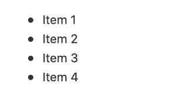
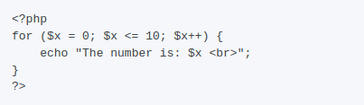

[Markdown](https://en.wikipedia.org/wiki/Markdown) é uma linguagem de marcação altamente simplificada utilizada para **formatar texto**. O SeaTable utiliza Markdown em vários sítios para formatar textos mais longos de uma forma visualmente apelativa.

Não precisa necessariamente de estar familiarizado com a sintaxe do Markdown. Mas quer esteja a utilizar o Markdown pela primeira vez ou já tenha experiência com ele, este artigo irá ajudá-lo a compreender melhor onde e como utilizar a versão SeaTable do Markdown.

## SeaTable Markdown

Existem actualmente cinco áreas onde pode utilizar a sintaxe Markdown no SeaTable. São elas:

- Colunas do tipo de [texto formatado]()
- [Descrições de base]()
- Textos de correio electrónico ao enviar através de [automações]()
- [Formulários Web]()
- [Aplicações universais]()

Assim que o Markdown for utilizado no SeaTable, ser-lhe-á apresentada a seguinte máscara de entrada. Naturalmente, pode marcar palavras ou blocos de texto como habitualmente e, em seguida, seleccionar a formatação pretendida.


Em alternativa, também pode activar a formatação Markdown directamente, introduzindo determinados caracteres especiais. Basta digitar um caractere especial num campo de entrada do Markdown.  seguido de uma palavra. Verá que o hash na sintaxe Markdown representa um primeiro título. Assim, se souber que carácter especial desencadeia que formatação, pode capturar e formatar os seus textos muito mais rapidamente.

Actualmente, só é possível activar parte da formatação com um carácter especial. Pode descobrir quais são estes caracteres neste artigo.



## Activar a formatação da sintaxe no SeaTable através de caracteres especiais

Actualmente, é possível activar as seguintes opções de sintaxe no SeaTable através de caracteres especiais.

### Manchetes

Uma linha que começa com um a três O carácter -, seguido de um espaço, resulta num **Título** do primeiro ao terceiro nível.

**Sintaxe Markdown**

\## Cabeçalho de primeiro nível  
\## Cabeçalho de segundo nível  
\### Cabeçalho de terceiro nível

**Resultado**


### Negrito e itálico

Texto escrito por um  ou  O casal está rodeado **itálico** formatado (que em Markdown significa uma ênfase); texto que é acompanhado por um duplo  ou  O casal está rodeado **ousado** formatado (o que significa grande ênfase em Markdown). A formatação também pode ser combinada com outros formatos em linha.

**Sintaxe Markdown**

\*Este texto será colocado em itálico  
Este também será em itálico

\*\*Este texto será apresentado a negrito\*\*  
\_\_Isto também será negrito\_\_

\_\*\*Combiná-los para negrito e itálico\*\*\_

**Resultado**

_Este texto ficará em itálico_  
_Este também será em itálico_

**Este texto será apresentado a negrito**  
**Isto também será negrito**

_**Combine-os para obter negrito e itálico**_

### Lista não ordenada

Pode  ou  como um marcador para um **lista não ordenada** utilização.



### Lista ordenada

Se uma linha começar com um é automaticamente convertido num **lista ordenada** convertido.

Número 1  
2\. Ponto 2

### Citações em bloco

A **Citação de bloco** é uma linha que começa com  e, em seguida, o conteúdo da citação. As citações são assinaladas por um travessão e uma moldura na margem esquerda.


### Código em linha

Texto escrito por um  é rodeado é representado como código em linha. Assim, de **apiKey é o seu token secreto da API** a seguinte formatação:


### Blocos de código

A **Bloco de códigos** é obtida através de três **Retrocessos**  introduzido. A característica especial do bloco de código é o facto de o conteúdo ser **Código em linha** é apresentado com tipo de letra monospace. Os recuos também são mantidos exactamente como foram introduzidos.



### Quebras de linha

Cada quebra de linha  é tratada como uma quebra de linha rígida com espaçamento entre as duas linhas. Uma quebra de linha sem espaçamento entre as linhas individuais não é possível. Também **quebras de linha múltiplas** são removidas e reduzidas a uma simples quebra de linha.

## Formatação que não pode ser activada com caracteres especiais

**Caixas de verificação** são normalmente representados em Markdown por um  ou um  é introduzido. No entanto, esta entrada não é automaticamente convertida numa caixa de verificação. Em vez disso, é necessário clicar no pequeno ícone da caixa de verificação  clique.

**As hiperligações** também são suportadas no SeaTable Markdown, mas só podem ser inseridas através do ícone .

## Formatação não suportada

 não é suportado pelo SeaTable. As quebras de linha duplicadas também são removidas e um  não é interpretado como uma quebra de linha adicional.
