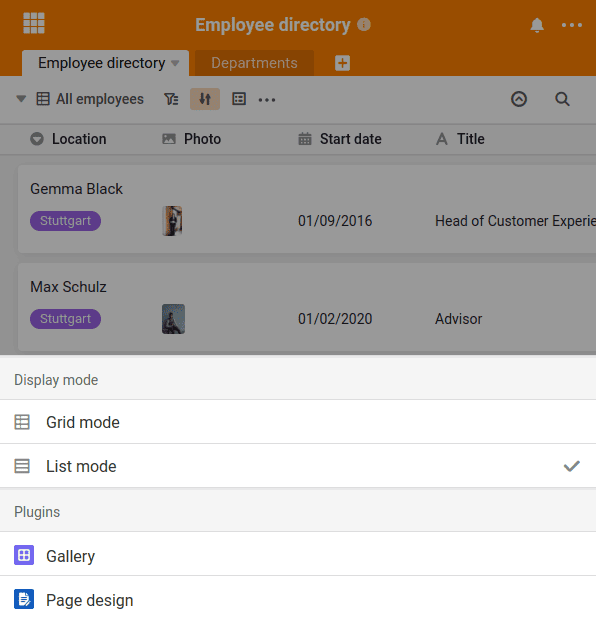

Of course, you can also use SeaTable on **mobile devices** like smartphones and tablets. SeaTable can be accessed either via browser or via the [Android app, which can be found in the Google Play Store](https://play.google.com/store/apps/details?id=io.seatable&pli=1). An app for iOS is already being planned, but no release date exists yet.

## Changed user interface at smaller resolutions

When you access SeaTable from a mobile device via a browser, SeaTable's user interface changes to optimize operation for small screen resolutions. The two most obvious changes are the two large round buttons at the bottom right of the screen.

About the  new entries can be created and via the  you can switch from the familiar list mode to the grid mode. In this representation, each row is displayed as a separate box, which makes it easier to select.

## Selection lists instead of small icons

Furthermore, the many small buttons that are otherwise familiar from the web interface are converted into generously sized selection lists. All functions can be reached quickly and are easy to use even on small screens.

## App or browser? In any case mobile-ready!

The functionality of SeaTable is identical in the app and browser. The Android app is not a separate application that has been completely reprogrammed, but only simplifies access to the SeaTable Cloud.

No matter which usage you choose: SeaTable's presentation tailored to small displays ensures that you can also work with SeaTable quickly and easily on mobile devices.
