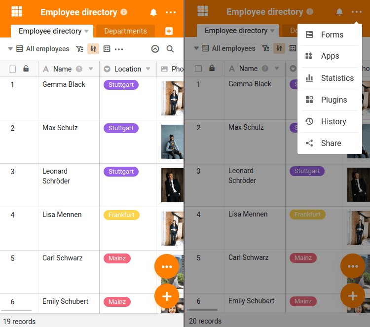
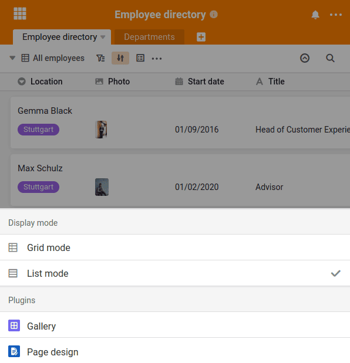

Naturalmente, também pode utilizar o SeaTable em **dispositivos móveis**, como smartphones e tablets. O SeaTable pode ser acedido através do browser ou da [aplicação para Android, que pode ser encontrada na Google Play Store](https://play.google.com/store/apps/details?id=io.seatable&pli=1). Já está a ser planeada uma aplicação para iOS, mas ainda não há data de lançamento.

## Interface de utilizador alterada em resoluções mais pequenas

Quando acede ao SeaTable através de um browser num dispositivo móvel, a interface do utilizador do SeaTable muda para optimizar o funcionamento para resoluções de ecrã pequenas. As duas alterações mais óbvias são os dois grandes botões redondos no canto inferior direito do ecrã.

Sobre o  podem ser criadas novas entradas e o  pode mudar do modo de lista familiar para o modo de grelha. Neste modo, cada linha é apresentada como uma caixa separada, o que facilita a sua selecção.

## Listas de selecção em vez de ícones pequenos

Além disso, os muitos botões pequenos que são familiares na interface Web são transformados em listas de selecção de dimensões generosas. Todas as funções são rapidamente acessíveis e podem ser facilmente operadas mesmo em ecrãs pequenos.

## Aplicação ou browser? Em todo o caso, pronto para telemóvel!

O âmbito funcional do SeaTable é idêntico na aplicação e no browser. A aplicação Android não é uma aplicação separada que tenha sido completamente reprogramada, mas apenas simplifica o acesso à SeaTable Cloud.

Independentemente da utilização que escolher: A apresentação do SeaTable, adaptada a ecrãs pequenos, garante que também pode trabalhar rápida e facilmente com o SeaTable em dispositivos móveis.
