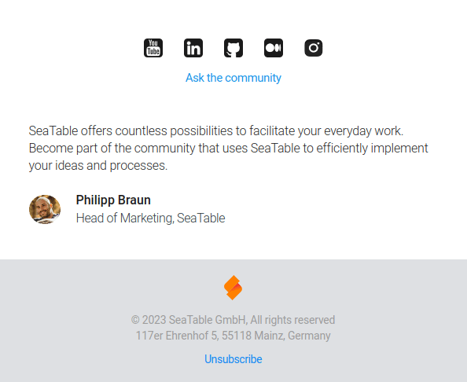
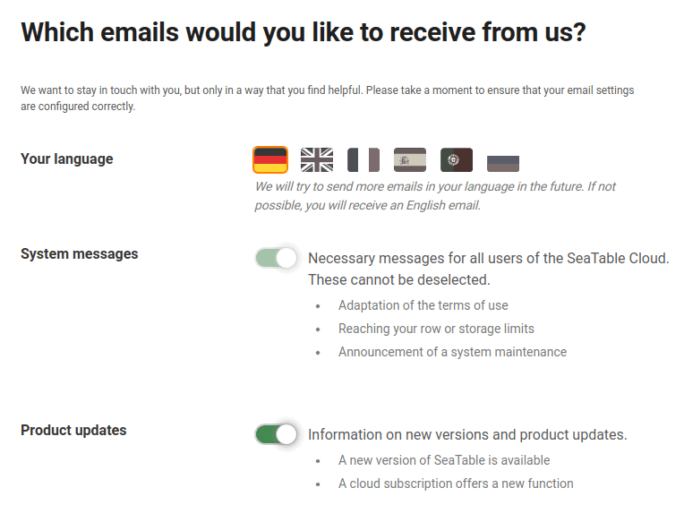

Make sure you only receive emails that are important to you by changing your email subscription settings.

Here is a listing of the different types of emails you may receive from us:

- **System messages**: Required messages for all SeaTable Cloud users. These cannot be deselected.
- **Product Updates**: Contains information about new versions and product updates of SeaTable.
- **Tips for beginners**: Help for a good start with the SeaTable Cloud. These will only be sent during the first week.
- **Newsletters & Events**: Emails on the efficient use and concrete application possibilities of SeaTable.

## To change your email subscription settings

1. Open one of the emails from SeaTable described above.
2. Scroll to the bottom of this email.
3. Click the **unsubscribe from newsletter** link.

4. Make the desired changes on the page that opens and save your changes.

