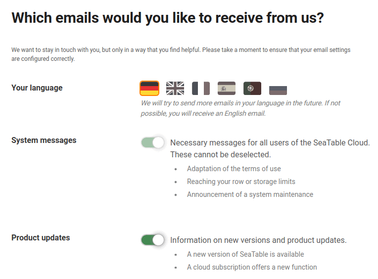

Veillez à ne recevoir que les e-mails contenant des informations importantes pour vous en modifiant vos paramètres d'abonnement à la messagerie.

Vous trouverez ici une liste des différents types d'e-mails que vous pouvez recevoir de notre part :

- **Messages du système**: Messages nécessaires pour tous les utilisateurs de SeaTable Cloud. Ils ne peuvent pas être désélectionnés.
- **Mises à jour produit**: contient des informations sur les nouvelles versions et les mises à jour produit de SeaTable.
- **Conseils pour débutants**: aide pour bien démarrer avec le nuage SeaTable. Ils ne sont envoyés que la première semaine.
- **Lettres d'information et événements**: E-mails sur l'utilisation efficace et les applications concrètes de SeaTable.

## Comment modifier vos paramètres d'abonnement au courrier électronique

1. Ouvrez l'un des e-mails de SeaTable décrits ci-dessus.
2. Faites défiler jusqu'à la fin de cet e-mail.
3. Cliquez sur le lien **Se désabonner de la newsletter**.

4. Effectuez les modifications souhaitées sur la page qui s'ouvre et enregistrez vos modifications.

