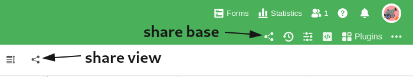

In Ihren Bases stehen Ihnen zwei verschiedene Freigabemöglichkeiten zur Verfügung, mit denen Sie entweder **einzelne Ansichten** oder Ihre **ganze Base** freigeben können.

Beide Freigaben erfolgen über den Freigeben-Dialog – ein Fenster, das Sie über die **Teilen-Icons**  in den Ansichts- oder Base-Optionen erreichen.

## Freigabe einer Base

Wenn Sie eine Ihrer Bases freigeben wollen, haben Sie die Wahl zwischen verschiedenen Optionen, je nachdem mit welchem Personenkreis Sie die Daten teilen möchten:

- [Freigabe für Benutzer](https://seatable.io/docs/freigabelinks/anlegen-einer-benutzerfreigabe/)
- [Freigabe für Gruppe](https://seatable.io/docs/freigabelinks/freigabe-einer-base-an-eine-gruppe/)
- [Freigabe via Einladungs-Link]()
- [Freigabe via externem Link](https://seatable.io/docs/freigabelinks/externer-link-erklaert/)

### Benutzerdefinierte Freigabe

Wenn Sie keine ganze Base, sondern nur Teile davon freigeben möchten, geht das natürlich auch. Die [benutzerdefinierte Freigabe](https://seatable.io/docs/berechtigungen/benutzerdefinierte-freigabe-erstellen/) ermöglicht es Ihnen, mehrere Tabellen und Ansichten gleichzeitig freizugeben und gebündelt an Teammitglieder oder ganze Gruppen zu versenden.

## Freigabe einer Ansicht

Wenn Sie nur eine einzelne Ansicht teilen möchten, kann die Freigabe an drei Personenkreise erfolgen:

- [Freigabe an ein Teammitglied]()
- [Freigabe an eine Gruppe](https://seatable.io/docs/ansichtsfreigaben/freigabe-einer-ansicht-an-eine-gruppe/)
- [Freigabe via externem Link]()

Weitere Informationen erhalten Sie auch im Artikel [Base- und Ansichtsfreigaben im Überblick]().
