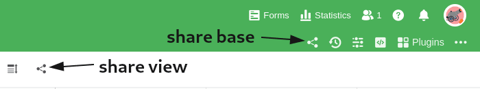
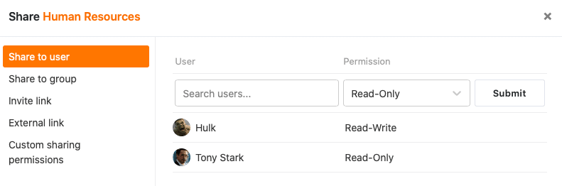
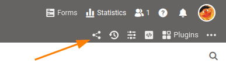

Dans vos bases, vous disposez de deux possibilités de partage différentes, qui vous permettent de partager soit **des vues individuelles**, soit l'**ensemble** de votre **base**.

Les deux partages se font via la boîte de dialogue Partager - une fenêtre à laquelle vous accédez via les **icônes de partage**  dans les options d'affichage ou de base.

## Partage d'une base

Si vous souhaitez partager l'une de vos bases, vous avez le choix entre différentes options, en fonction du cercle de personnes avec lequel vous souhaitez partager les données :

- [Partage avec les utilisateurs]()
- [Validation pour le groupe]()
- [Partage via le lien d'invitation]()
- [Partage via un lien externe]()

### Partage personnalisé

Si vous ne souhaitez pas partager une base entière, mais seulement des parties, cela est bien sûr également possible. Le [partage personnalisé]() vous permet de partager plusieurs tableaux et vues en même temps et de les envoyer de manière groupée à des membres de l'équipe ou à des groupes entiers.

## Partage d'une vue

Si vous ne souhaitez partager qu'une seule vue, le partage peut être effectué avec trois cercles de personnes :

- [Partage avec un membre de l'équipe]()
- [Partage avec un groupe]()
- [Partage via un lien externe]()

Vous trouverez également de plus amples informations dans l'article [Aperçu des autorisations de base et de vue]().
