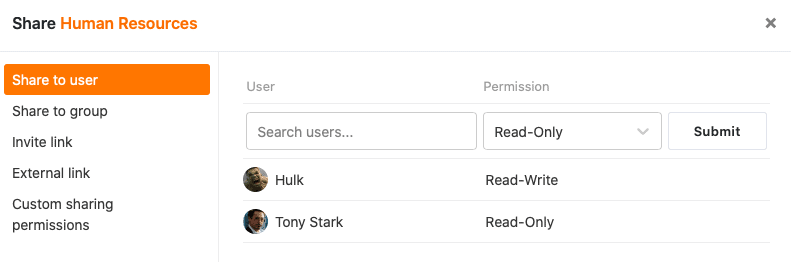

В ваших базах доступны два варианта совместного использования, позволяющие делиться либо **отдельными видами**, либо **всей базой**.

Оба обмена осуществляются через диалог **обмена** - окно, в которое вы попадаете через **значки обмена**  в опциях просмотра или базы.

## Освобождение базы

Если вы хотите поделиться одной из своих баз, у вас есть выбор вариантов в зависимости от того, с кем вы хотите поделиться ею:

- [Выпуск для пользователей](https://seatable.io/ru/docs/freigabelinks/anlegen-einer-benutzerfreigabe/)
- [Освобождение для группы](https://seatable.io/ru/docs/freigabelinks/freigabe-einer-base-an-eine-gruppe/)
- [Выпуск по пригласительной ссылке]()
- [Релиз по внешней ссылке](https://seatable.io/ru/docs/freigabelinks/externer-link-erklaert/)

### Пользовательская доля

Если вы хотите поделиться не всей базой, а только ее частями, это, конечно, тоже возможно. [Пользовательский общий доступ](https://seatable.io/ru/docs/berechtigungen/benutzerdefinierte-freigabe-erstellen/) позволяет одновременно предоставлять общий доступ к нескольким таблицам и представлениям и отправлять их в пакете членам команды или целым группам.

## Освобождение вида

Если вы хотите поделиться только одним видом, обмен может быть осуществлен с тремя группами людей:

- [Освобождение члена команды]()
- [Освобождение для группы](https://seatable.io/ru/docs/ansichtsfreigaben/freigabe-einer-ansicht-an-eine-gruppe/)
- [Релиз по внешней ссылке]()

Для получения дополнительной информации см. также статью [Base and view releases]() at a glance.
