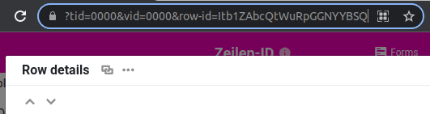

**Идентификатор строки** - это **уникальное обозначение строки**, которое, в отличие от нумерации по представлениям, не может быть изменено. Идентификатор строки обычно нужен при написании **сценариев** на JavaScript или Python.

## Считывание идентификатора строки из URL

1. Подведите мышь к нумерации в начале строки.
2. Откройте **детали ряда**, нажав на **значок двойной стрелки**.
3. Как только новое окно открылось, можно взять идентификатор ряда из **URL**: **row-id='ZEILEN-ID'**

## Считайте ID по формуле

В колонке **Формула** есть возможность отобразить ID всех рядов одновременно. Формула **rowid()** возвращает ID каждого ряда. Это можно использовать, например, для действий с кнопками или автоматики.
