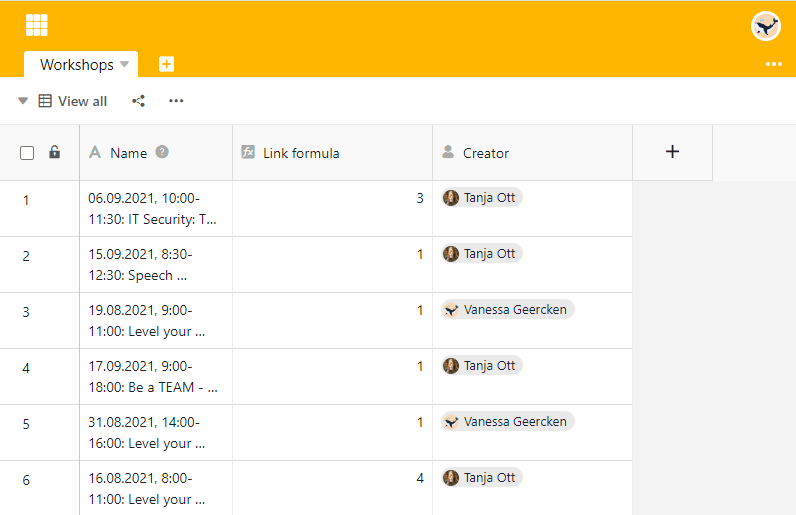

You want to find out **who** added a row? Then create a column of the type [creator](). Here the **name of the user** who created the column is unchangeable.

## Create the creator column

1. Add a **new column** using the plus symbol in the table header.
2. Give the column a **name**.
3. Select the **Creator** column type.
4. Click **Submit**.

## Show more row details via columns

In addition, you can use other column types to display _when_ a row was **created** and **last edited** and _who_ changed it as the **last editor**.



In addition to the **Creator** column type, the contents of the **Created time**, [Last modifier and Last modified time]() columns are also immutable.


