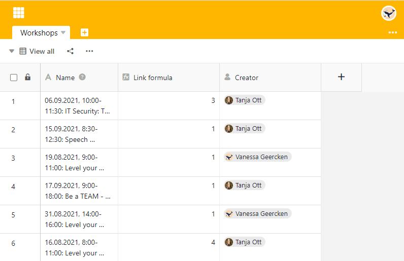

Quer descobrir **quem** acrescentou uma fila? Então crie uma coluna do tipo [Criador](). Aqui, o **nome do utilizador** que criou a coluna é imutável.

## Criar a coluna do criador

1. Adicionar uma **nova coluna** através do símbolo de mais no cabeçalho da tabela.
2. Dê um **nome** à coluna.
3. Seleccionar o tipo de coluna **Creator**.
4. Clique em **Submeter**.

## Mostrar mais detalhes da linha através de colunas

Além disso, pode utilizar outros tipos de colunas para mostrar _quando_ uma linha foi **criada** e **editada pela última vez** e _quem_ a alterou como **último editor**.



Além do tipo de coluna **Criador**, o conteúdo das colunas **Tempo criado**, [Último modificador e Último tempo modificado]() são também imutáveis.


