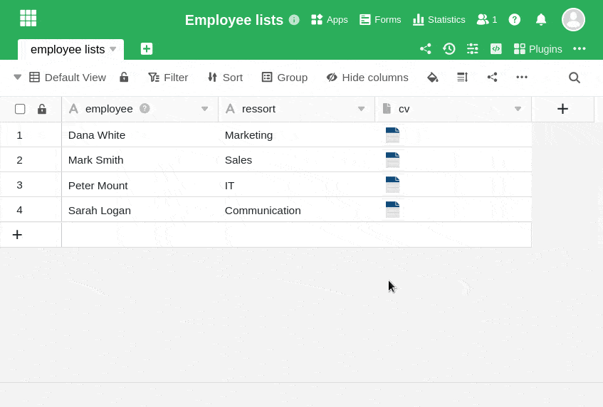
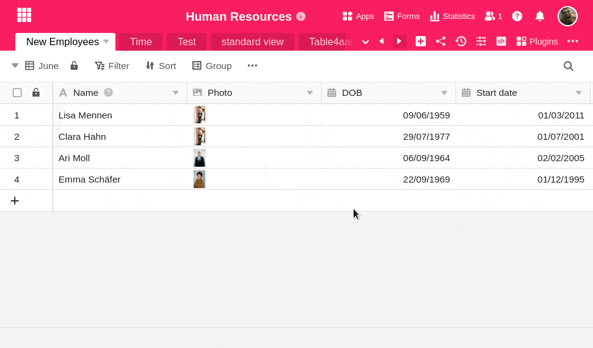

**Os ficheiros** e **imagens** removidos de uma [coluna de]() ou [de ficheiros]() **não** são **permanentemente eliminados**. Estes ficheiros eliminados permanecem no [gestor de ficheiros]() Base e podem ser **restaurados** de duas formas diferentes.

## Último carregamento

1. Abra a janela **Todos os ficheiros** ou **Todas as imagens** com um **duplo clique** na **célula de** um ficheiro ou coluna de imagem.
2. Clique no botão **Adicionar ficheiros/fotos** e, em seguida, seleccione a opção **Último carregamento**.
3. Seleccione qualquer **ficheiro (de imagem)** de uma das pastas e clique nele.
4. Agora clique em **Enviar** no canto inferior direito e o ficheiro (imagem) selecionado será novamente adicionado à coluna Ficheiro ou Imagem.

## Gestão de ficheiros da base

1. Clique nos **três pontos** no cabeçalho da Base e seleccione **Gestão de ficheiros**. Também pode adicionar esta opção como um acesso rápido à sua barra de ferramentas.
2. Na janela que se abre, encontrará um **sistema de pastas** com todos os ficheiros que estão armazenados na sua base.
3. Basta arrastar e largar o ficheiro (imagem) pretendido do gestor de ficheiros para a coluna de ficheiros ou imagens adequada.

