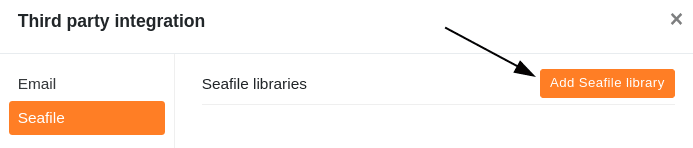
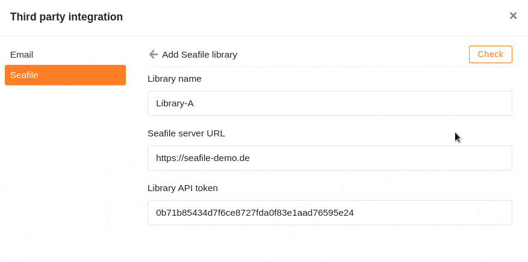

Wenn Sie viele größere Dateien (z. B. Bilder und Videos) in einer Base speichern, können Sie zum einen irgendwann an die [Speicherlimits Ihres Abonnements]() stoßen, und zum anderen wird es über 100 MB nicht mehr möglich sein, die Base als [DTABLE-Datei]() zu [exportieren]().

Eine Lösung, um in diesem Fall die Limits einzuhalten, ist die Auslagerung Ihrer Dateien in einen Cloudspeicher wie **Seafile**, den Sie anschließend an SeaTable anbinden können. Im folgenden Artikel erfahren Sie, wie Sie eine Seafile Bibliothek in eine Base integrieren.



## So binden Sie eine Seafile Bibliothek an SeaTable an

1. Öffnen Sie das Seafile Webinterface und melden Sie sich mit Ihrem **Seafile Konto** an.
1. Klicken Sie auf das **Drop-down-Symbol**, um die erweiterten Optionen einer **Seafile Bibliothek** zu öffnen, und klicken Sie auf **API Token**.

    

1. **Benennen** Sie den **Token**, vergeben Sie eine Lese- und Schreibberechtigung oder nur eine Leseberechtigung und erstellen Sie den Token über **Abschicken**.

    

1. **Kopieren** Sie den API Token in den Zwischenspeicher.

    

1. Öffnen Sie im Anschluss das **SeaTable Webinterface** und gehen Sie in die Base, in die Sie die **Bibliothek** einbinden wollen.
1. Klicken Sie auf die **drei Punkte** im Base-Header, um die erweiterten Base-Optionen zu öffnen, und wählen Sie die Option **Integration von Drittanbieter** aus.

    

1. Klicken Sie im Bereich Seafile auf **Seafile Bibliothek hinzufügen.**

    

1. Geben Sie den **Namen der Bibliothek**, die **URL Ihres Seafile Servers** und den zuvor kopierten **API Token** der Bibliothek ein.

    

1. Klicken Sie abschließend auf **Überprüfen**. Nach erschienener Erfolgsmeldung bestätigen Sie die Einbindung mit **Abschicken**.

    

## Auf Dateien in Seafile zugreifen

Nach erfolgreicher Einbindung in die Base erscheint die **Seafile Bibliothek** als Ordner im [Dateimanagement]() Ihrer Base.

Über diese Integration können Sie die in Seafile gespeicherten Dateien direkt in SeaTable nutzen.

## Integrationsmöglichkeiten

Grundsätzlich können Sie sowohl selbstgehostete als auch gehostete Seafile Server mit SeaTable verbinden. [Wenden Sie sich gern an unser Sales Team](https://seatable.io/kontakt/), wenn Sie einen Seafile Server selbst hosten wollen. Für SeaTable Dedicated Kunden bieten wir ein Seafile Co-Hosting an.
