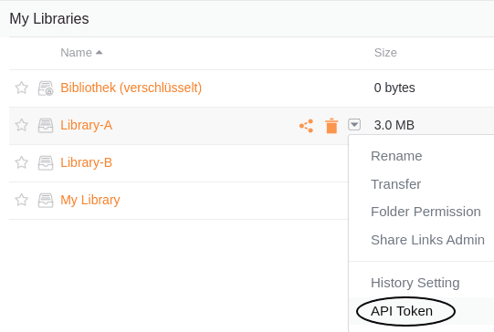
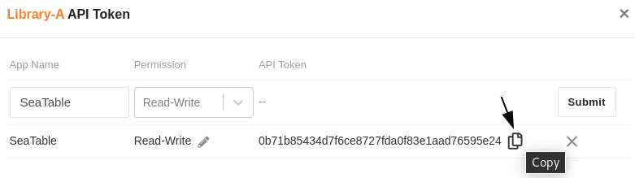
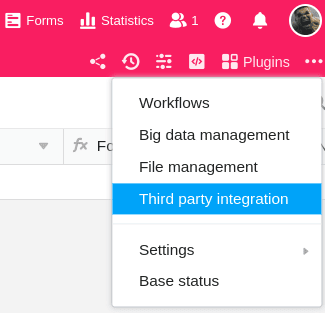

Si almacena muchos archivos de gran tamaño (por ejemplo, imágenes y vídeos) en una base, es posible que con el tiempo alcance los [límites de almacenamiento de su suscripción]() y no sea posible [exportar]() de más de 100 MB.

Una solución para cumplir con los límites en este caso es externalizar sus archivos a un almacenamiento en la nube como **Seafile**, que luego puede conectar a SeaTable. En el siguiente artículo aprenderás a integrar una biblioteca Seafile en una Base.



## Para conectar una biblioteca Seafile a SeaTable

1. Abra la interfaz web de **Seafile** e inicie sesión con su **cuenta de Seafile**.
2. Haga clic en el **icono desplegable** para abrir las opciones avanzadas de una **biblioteca Seafile** y haga clic en **Token API**.

3. **Nombre el** **token**, asigne un permiso de lectura y escritura o un permiso de sólo lectura y cree el token mediante **Submit**.

4. **Copie** el token de la API en el portapapeles.

5. A continuación, abra la **interfaz web de SeaTable** y vaya a la base en la que desea integrar la **biblioteca**.
6. Haga clic en los **tres puntos** de la cabecera Base para abrir las opciones avanzadas de Base y seleccione la opción **Integración de terceros**.

7. En el área Seafile, haga clic en **Add Seafile Library**.

8. Introduzca el **nombre de la biblioteca**, la **URL de su servidor Seafile** y el **token API de** la biblioteca que ha copiado anteriormente.

9. Por último, haga clic en **Consulte**. Después de que aparezca el mensaje de éxito, confirme la integración con **Enviar**.  
    

## Acceso a archivos en Seafile

Tras una integración satisfactoria en la base, la biblioteca **Seafile** aparece como una carpeta en la [gestión de archivos]() de su base.

Esta integración le permite utilizar los archivos almacenados en Seafile directamente en SeaTable.

## Posibilidades de integración

En principio, puede conectar a SeaTable tanto servidores Seafile autoalojados como alojados. [No dude en ponerse en contacto con nuestro equipo de ventas]() si desea autoalojar un servidor Seafile. Para los clientes de SeaTable Dedicated ofrecemos el coalojamiento de Seafile.
