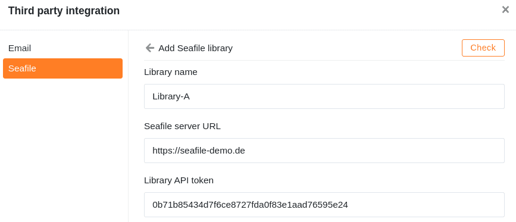

Si vous enregistrez beaucoup de fichiers volumineux (par exemple des images et des vidéos) dans une base, vous risquez d'une part d'atteindre un jour les [limites de stockage de votre abonnement]() et d'autre part, au-delà de 100 Mo, il ne sera plus possible d'[exporter]() la base en tant que [fichier DTABLE]().

Une solution pour respecter les limites dans ce cas est d'externaliser vos fichiers dans un stockage en nuage comme **Seafile**, que vous pouvez ensuite connecter à SeaTable. Dans l'article suivant, vous apprendrez comment intégrer une bibliothèque Seafile dans une base.



## Pour lier une bibliothèque Seafile à SeaTable, procédez comme suit

1. Ouvrez l'interface web Seafile et connectez-vous avec votre **compte Seafile**.
2. Cliquez sur l'**icône déroulante** pour ouvrir les options avancées d'une **bibliothèque Seafile** et cliquez sur **API Token**.

    

3. **Nommez** le **token**, attribuez une autorisation de lecture et d'écriture ou seulement une autorisation de lecture et créez le token en cliquant sur **Envoyer**.

    

4. **Copiez** le jeton API dans le cache.

    

5. Ouvrez ensuite l'**interface web de SeaTable** et allez dans la base dans laquelle vous souhaitez intégrer la **bibliothèque**.
6. Cliquez sur les **trois points** dans l'en-tête de la base pour ouvrir les options avancées de la base et sélectionnez l'option **Intégration de tiers**.

    

7. Dans la section Seafile, cliquez sur **Ajouter une bibliothèque Seafile.**

    

8. Saisissez le **nom de la bibliothèque**, l'**URL de votre serveur Seafile** et le **jeton API** de la bibliothèque que vous avez copié précédemment.

    

9. Cliquez enfin sur **Vérifier**. Une fois le message de réussite affiché, confirmez l'intégration en cliquant sur **Envoyer**.

    

## Accéder aux fichiers dans Seafile

Nach erfolgreicher Einbindung in die Base erscheint die **Seafile Bibliothek** als Ordner im [Dateimanagement](https://seatable.io/fr/docs/dateien-und-bilder/das-dateimanagement-einer-base/) Ihrer Base.

Cette intégration vous permet d'utiliser les fichiers stockés dans Seafile directement dans SeaTable.

## Possibilités d'intégration

En principe, vous pouvez connecter à SeaTable aussi bien des serveurs Seafile auto-hébergés que des serveurs hébergés. N ['hésitez pas à contacter notre équipe commerciale]() si vous souhaitez héberger vous-même un serveur Seafile. Pour les clients SeaTable dédiés, nous proposons un co-hébergement Seafile.
