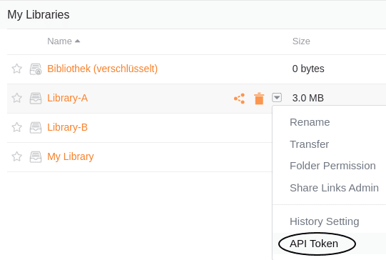
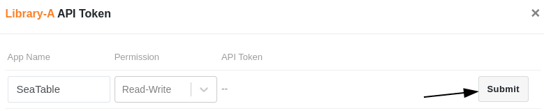
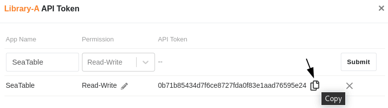
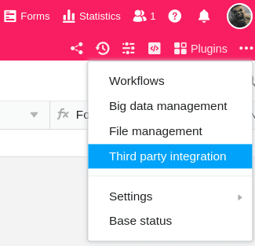
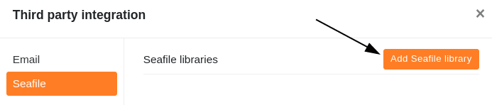
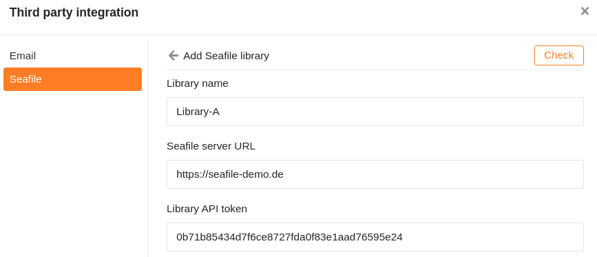
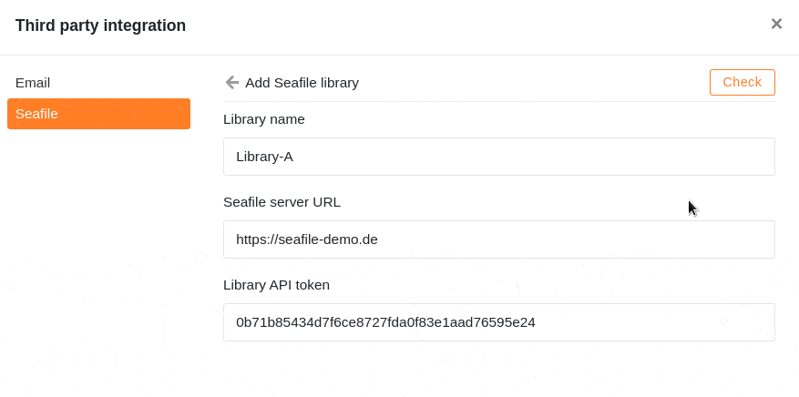
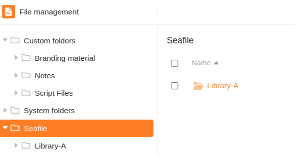

Se armazenar muitos ficheiros maiores (por exemplo, imagens e vídeos) numa base, poderá eventualmente atingir os [limites de armazenamento da sua subscrição]() e não será possível [exportar]() com mais de 100 MB.

Uma solução para respeitar os limites neste caso é externalizar os seus ficheiros para um armazenamento em nuvem como o **Seafile**, que pode depois ligar ao SeaTable. No artigo seguinte, aprenderá a integrar uma biblioteca Seafile numa Base.



## Para ligar uma biblioteca Seafile ao SeaTable

1. Abra a interface Web do Seafile e inicie sessão com a sua **conta Seafile**.
2. Clique no **ícone suspenso** para abrir as opções avançadas de uma **biblioteca Seafile** e clique em **Token de API**.

4. **Dê um nome ao** **token**, atribua uma permissão de leitura e escrita ou uma permissão só de leitura e crie o token através de **Enviar**.

6. **Copiar** o token da API para a área de transferência.

8. Em seguida, abra a **interface Web do SeaTable** e aceda à base na qual pretende integrar a **biblioteca**.
9. Clique nos **três pontos** no cabeçalho da Base para abrir as opções avançadas da Base e seleccione a opção **Integração de terceiros**.

11. Na área Seafile, clique em **Adicionar biblioteca de Seafile**.

13. Introduza o **nome da biblioteca**, o **URL do seu servidor Seafile** e o **token da API da** biblioteca que copiou anteriormente.

15. Por fim, clique em **Verificar**. Após o aparecimento da mensagem de sucesso, confirmar a integração com **Enviar**.  
    

## Aceder a ficheiros no Seafile

Nach erfolgreicher Einbindung in die Base erscheint die **Seafile Bibliothek** als Ordner im [Dateimanagement]() Ihrer Base.

Esta integração permite-lhe utilizar os ficheiros armazenados no Seafile diretamente no SeaTable.

## Possibilidades de integração

Em princípio, é possível ligar servidores Seafile auto-hospedados e hospedados ao SeaTable. Não [hesite em contactar a nossa equipa de vendas]() se quiser auto-hospedar um servidor Seafile. Para os clientes SeaTable Dedicated, oferecemos o co-hosting do Seafile.
