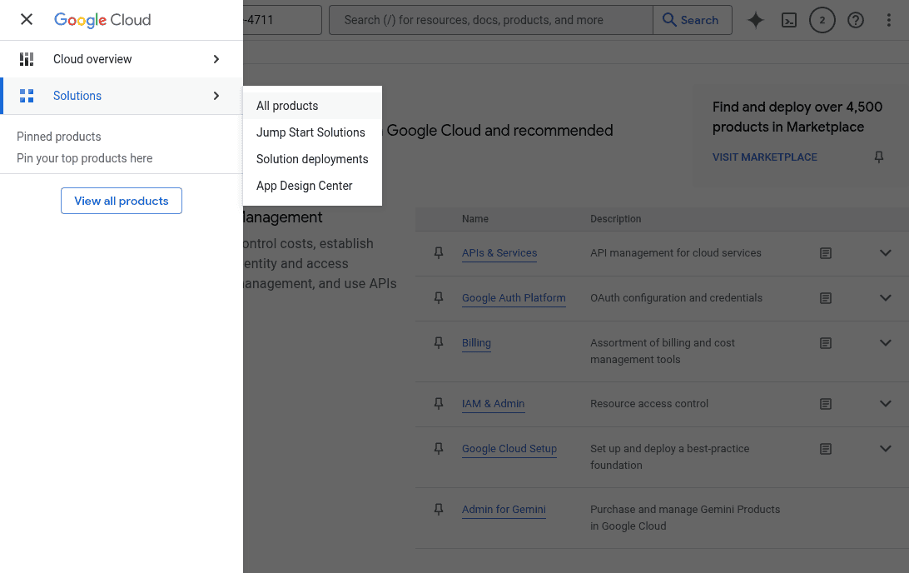

Gmail, der beliebte E-Mail-Dienst von Google, kann für den Versand von E-Mails aus SeaTable heraus verwendet werden. Die Authentifizierung gegenüber dem Google Konto kann entweder über ein App-Passwort oder via OAuth erfolgen. OAuth ist das von Google präferierte Verfahren, gleichzeitig aber in der Einrichtung deutlich schwieriger. (Die Authentifizierung über Benutzername und Benutzer-Passwort ist bei Gmail nicht möglich.)



## Authentifizierung mittels App-Passwort

Ein [App-Passwort](https://support.google.com/accounts/answer/185833?hl=de) ist ein 16-stelliger Sicherheitscode, mit dem sich Apps oder Geräte gegenüber Google authentifizieren können und dadurch Zugriff auf das Gmail Konto erhalten. App-Passwörter können Sie in Ihrem [Google Konto](https://myaccount.google.com/) erstellen. App-Passwörter können nur für Konten verwendet werden, bei denen die 2‑Faktor-Authentifizierung aktiviert ist.

### Erstellung eins App-Passworts

1. Öffnen Sie die [Verwaltung der App-Passwörter](https://myaccount.google.com/apppasswords) von Google - loggen Sie sich in Ihr **Google Konto** ein, wenn Sie dazu aufgefordert werden.
2. Geben Sie einen **Namen** ein, z.B. 'SeaTable', und klicken auf "Erstellen".

 4. Kopieren Sie das generierte App-Passwort in den Zwischenspeicher.



### Anlage des E-Mail-Kontos in SeaTable

Nun müssen Sie Ihr Google Mail-Konto als Drittanbieter in Ihrer SeaTable Base hinzufügen. Dazu sind die folgenden Schritte notwendig:

1. Öffnen Sie die erweiterten Base-Optionen mit einem Klick auf das **Drei-Punkte-Icon**  in der rechten oberen Ecke.
2. Wählen Sie die Option **Integration von Drittanbietern** aus.
   4. Klicken Sie auf **E-Mail-Konto hinzufügen**.
3. Wählen Sie als Diensteanbieter **Generischer E-Mail-Provider**.
4. Geben Sie die folgenden Informationen ein:
    - **Kontoname**: ein beliebiger Name für das Konto, z.B. 'Gmail'
    - **SMTP-Server**: 'smtp.gmail.com'
    - **SMTP-Port**: '587'
    - **Benutzername**: Ihre Gmail Adresse, z.B. 'seatable@gmail.com'
    - **Passwort**: das erzeugte App-Passwort aus dem Zwischenspeicher


## Authentifizierung via OAuth 2.0

OAuth 2.0, kurz für Open Authorization 2.0, ist ein offenes Protokoll, das (Web-)Anwendungen sicheren Zugriff auf Benutzerkonten anderer Anwendungen ermöglicht. So kann ein Benutzer aus einer Anwendung Ressourcen bzw. Dienste einer anderen Anwendung nutzen, z.B. aus SeaTable heraus E-Mails über Gmail versenden.

Damit SeaTable via OAuth 2.0 auf ein Gmail Konto zugreifen kann, müssen Sie in der [Cloud Console von Google](<a href=) eine Client-ID und einen Clientschlüssel erstellen und diese in SeaTable abspeichern.

### Erstellung der Zugangsdaten in der Google Cloud Console

Als Platform für Entwickler wirkt die Cloud Console für normale Benutzer unübersichtlich. Lassen Sie sich davon nicht beeindrucken. Mit der folgenden Schritt-für-Schritt-Anleitung ist die Einrichtung für jedermann machbar.

1. Öffnen Sie die [Google Cloud Console](https://console.developers.google.com/) und loggen Sie sich in Ihr **Google Konto** ein, wenn Sie dazu aufgefordert werden.
2. Erstellen Sie zunächst ein neues Projekt. In diesem werden alle nachfolgend erläuterten Einstellungen vorgenommen. Geben Sie einen Projektnamen ein (z.B. 'SeaTable') und wählen Sie den Speicherort aus. (Wenn keine Organisationen definiert sind, behalten Sie "Keine Organisation" bei.)
3. Erlauben Sie dem erstellten Projekt die Nutzung der Gmail API. Klicken Sie dafür mit der Maus in das Suchfeld am oberen Bildschirmrand, geben "Gmail API" ein und klicken dann auf das entsprechende Suchergebnissen. Aktivieren Sie die Google API.
4. Alle weiteren Schritte erfolgen in der **Google Auth Platform**. Klicken Sie auf das Sandwich-Icon in der linken oberen Ecke und wählen dann "Alle Produkte" in der Rubrik "Lösungen". Auf der Produkteseite klicken Sie auf "Google Auth Platform".

 6. Nehmen Sie die **notwendigen Konfigurationen** an der Google Auth Platform vor: Geben Sie einen Anwendungsnamen, eine Support- und eine Kontakt-E-Mail-Adresse ein (z.B. Ihre Gmail Adresse). Als Zielgruppe wählen Sie "Extern" aus. Akzeptieren Sie die Nutzungsbedingungen und schließen Sie die Konfiguration ab. 7. Klicken Sie in der Seitennavigation der Google Auth Platform auf **"Zielgruppe"**. Fügen Sie Ihre Google E-Mail-Adresse als Testnutzer hinzu. 8. Klicken Sie in der Seitennavigation der Google Auth Platform auf **"Clients"** und erstellen einen OAuth 2.0-Client. Wählen Sie als Anwendungstyp für den OAuth-Client "Webanwendung" und geben Sie einen Namen ein (z.B. 'SeaTable'). Überspringen Sie die "Autorisierte JavaScript-Quellen" und fügen Sie als "Autorisierte Weiterleitungs-URI" folgende URI ein:

    ```
    https://cloud.seatable.io/oauth/third-party-email-accounts/callback/
    ```

    Wenn Sie nicht SeaTable Cloud verwenden, dann ersetzen Sie cloud.seatable.io durch den Hostname Ihrer SeaTable Instanz. Scrollen Sie ans Ende der Seite und bestätigen Sie die Erstellung des OAuth-Clients.


12. Der neu angelegte Client wird nun in der Liste der OAuth 2.0 Clients angezeigt. Die Einstellungen des Clients lassen sich mit einem Klick auf dessen Namen anzeigen. Die angezeigte Client-ID und der Clientschlüssel sind für die folgende Einrichtung in SeaTable essentiell.

Wenn Sie während der Konfiguration verklickt haben und nicht mehr wissen, wo Sie sind, dann klicken Sie auf das Sandwich-Icon oben rechts. Von dort können Sie wieder zur Google Auth Platform navigieren.

### Anlage des E-Mail-Kontos in SeaTable

Nun müssen Sie Ihr Google Mail-Konto als Drittanbieter in Ihrer SeaTable Base hinzufügen. Dazu sind die folgenden Schritte notwendig:

1. Öffnen Sie die erweiterten Base-Optionen mit einem Klick auf das **Drei-Punkte-Icon**  in der rechten oberen Ecke.
2. Wählen Sie die Option **Integration von Drittanbietern** aus.
3. Klicken Sie auf **E-Mail-Konto hinzufügen**.
4. Wählen Sie als Diensteanbieter **Gmail**.
5. Geben Sie die folgenden Informationen ein:

    - **Kontoname**: ein beliebiger Name für das Konto, z.B. 'Gmail'
    - **Benutzername**: 'me'
    - **Client-ID**: der Clientschlüssel des erstellten OAuth-Clients
    - **Clientschlüssel**: der Clientschlüssel des erstellten OAuth-Clients

6. Bestätigen Sie die Erstellung des E-Mail-Kontos mit OAuth2 Authentifizierung.
7. Loggen Sie sich nun in dem sich öffnenden Dialog in Ihr Google Konto ein.
8. Klicken Sie auf "Weiter", wenn Sie darauf hingewiesen werden, dass diese App nicht überprüft wurde und erlauben Sie den Zugriff auf das Google Konto.

## E-Mails per Automation versenden

Danach können Sie das in Ihrer SeaTable Base angelegte E-Mail-Konto verwenden, um E-Mails per Automation oder [Schaltfläche]() zu verschicken.

Wenn Sie mehr über diese nützliche Automation erfahren wollen, lesen Sie den Artikel [E-Mail-Versand per Automation]().
