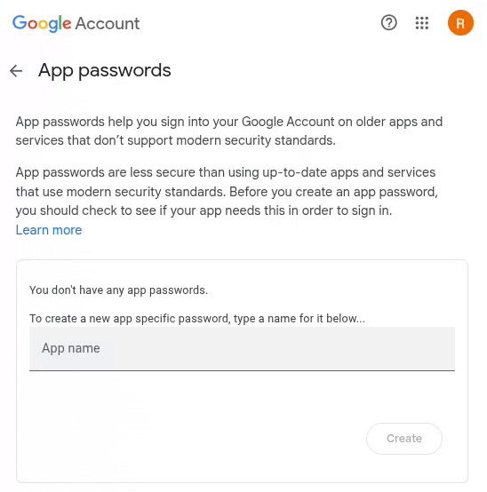
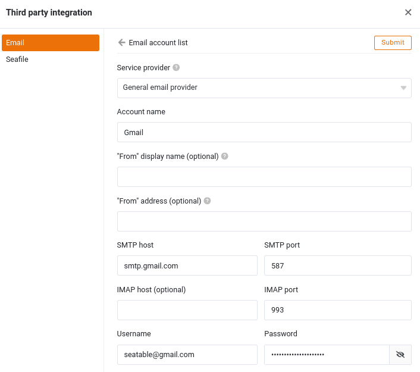
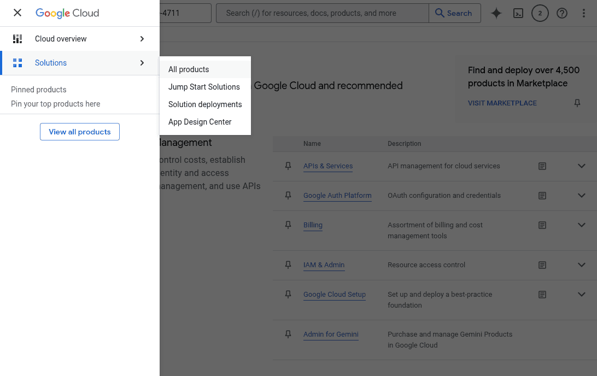
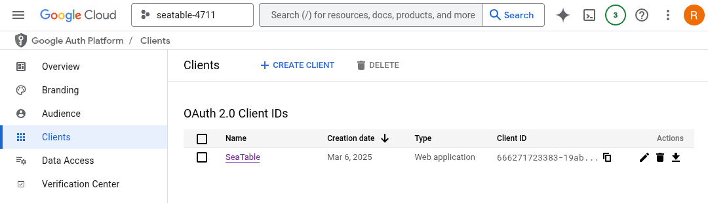

Gmail, популярный почтовый сервис Google, можно использовать для отправки писем из SeaTable. Аутентификация с помощью аккаунта Google может осуществляться либо через пароль приложения, либо через OAuth. Метод OAuth предпочитает Google, но его гораздо сложнее настроить. (Аутентификация по имени пользователя и паролю невозможна в Gmail).



## Аутентификация с помощью пароля приложения

[Пароль приложения](https://support.google.com/accounts/answer/185833?hl=de) - это 16-значный код безопасности, с помощью которого приложения или устройства могут аутентифицировать себя в Google и таким образом получить доступ к вашему аккаунту Gmail. Вы можете создавать пароли приложений в своем [аккаунте Google](https://myaccount.google.com/). Пароли приложений можно использовать только для тех аккаунтов, в которых включена двухфакторная аутентификация.

### Создание пароля приложения

1. Откройте [приложение](https://myaccount.google.com/apppasswords) Google ["Управление паролями](https://myaccount.google.com/apppasswords) " - войдите в свою **учетную запись Google**, когда появится запрос.
2. Введите **имя**, например "SeaTable", и нажмите "Создать".



4. Скопируйте сгенерированный пароль приложения в кэш.



### Создание учетной записи электронной почты в SeaTable

Теперь вам нужно добавить учетную запись Gmail в качестве третьего лица в базу SeaTable. Для этого необходимо выполнить следующие действия:

1. Откройте опции расширенной базы, нажав на **значок с тремя точками**  в правом верхнем углу.
2. Выберите опцию **Интеграция сторонних провайдеров.**


4. Нажмите на кнопку **Добавить учетную запись электронной почты**.
5. В качестве поставщика услуг выберите **Generic e-mail** provider.
6. Введите следующую информацию:
    - **Имя учетной записи**: любое имя учетной записи, например "Gmail".
    - **SMTP-сервер**: 'smtp.gmail.com'
    - **Порт SMTP**: '587'
    - **Имя пользователя**: ваш адрес Gmail, например, 'seatable@gmail.com'.
    - **Пароль**: сгенерированный пароль приложения из кэша.



## Аутентификация через OAuth 2.0

OAuth 2.0, сокращение от Open Authorisation 2.0, - это открытый протокол, который позволяет (веб-приложениям) безопасно получать доступ к учетным записям других приложений. Это означает, что пользователь может использовать ресурсы или услуги другого приложения из одного приложения, например, отправлять электронные письма из SeaTable через Gmail.

Чтобы SeaTable мог получить доступ к учетной записи Gmail через OAuth 2.0, вы должны создать идентификатор клиента и ключ клиента в [облачной консоли Google](<a href=) и сохранить их в SeaTable.

### Создание данных доступа в Google Cloud Console

Будучи платформой для разработчиков, Cloud Console кажется запутанной для обычных пользователей. Пусть это не производит на вас впечатления. С помощью следующего пошагового руководства любой сможет настроить ее.

1. Откройте [Google Cloud Console](https://console.developers.google.com/) и войдите в свою **учетную запись Google**, когда появится запрос.
2. Сначала создайте новый проект. Все настройки, описанные ниже, выполняются в этом проекте. Введите имя проекта (например, "SeaTable") и выберите место хранения. (Если организации не определены, сохраните "Нет организации").
3. Разрешите созданному проекту использовать Gmail API. Для этого щелкните мышью в поле поиска в верхней части экрана, введите "Gmail API", а затем щелкните на соответствующем результате поиска. Активируйте API Google.
4. Все дальнейшие действия выполняются в **Google Auth Platform**. Нажмите на значок сэндвича в левом верхнем углу, а затем выберите "Все продукты" в разделе "Решения". На странице продукта нажмите на "Google Auth Platform".



6. Выполните **необходимые настройки** на платформе Google Auth: Введите имя приложения, адрес электронной почты службы поддержки и контактный адрес электронной почты (например, ваш адрес Gmail). Выберите "Внешний" в качестве целевой группы. Примите условия использования и завершите настройку.
7. Нажмите на **"Целевая группа"** в постраничной навигации Google Auth Platform. Добавьте свой адрес электронной почты Google в качестве тестового пользователя.
8. В навигации по страницам Google Auth Platform нажмите на **"Клиенты"** и создайте клиента OAuth 2.0. Выберите "Веб-приложение" в качестве типа приложения для клиента OAuth и введите имя (например, 'SeaTable'). Пропустите пункт "Авторизованные источники JavaScript" и добавьте следующий URI в качестве "Авторизованного URI пересылки":

    ```
    https://cloud.seatable.io/oauth/third-party-email-accounts/callback/
    ```

    Если вы не используете SeaTable Cloud, замените cloud.seatable.io на имя хоста вашего экземпляра SeaTable. Прокрутите страницу в самый низ и подтвердите создание OAuth-клиента.



10. Созданный клиент теперь отображается в списке клиентов OAuth 2.0. Настройки клиента можно открыть, щелкнув на его имени. Отображаемые идентификатор клиента и ключ клиента необходимы для последующей настройки в SeaTable.

Если вы ошиблись при настройке и больше не знаете, где находитесь, нажмите на значок сэндвича в правом верхнем углу. Оттуда вы сможете вернуться на платформу Google Auth.

### Создание учетной записи электронной почты в SeaTable

Теперь вам нужно добавить учетную запись Gmail в качестве третьего лица в базу SeaTable. Для этого необходимо выполнить следующие действия:

1. Откройте опции расширенной базы, нажав на **значок с тремя точками**  в правом верхнем углу.
2. Выберите опцию **Интеграция сторонних провайдеров.**
3. Нажмите на кнопку **Добавить учетную запись электронной почты**.
4. Выберите **Gmail** в качестве поставщика услуг.
5. Введите следующую информацию:

    - **Имя учетной записи**: любое имя учетной записи, например "Gmail".
    - **Имя пользователя**: 'я'
    - **Идентификатор клиента**: клиентский ключ созданного клиента OAuth
    - **Ключ клиента**: ключ клиента созданного OAuth-клиента

6. Подтвердите создание учетной записи электронной почты с помощью аутентификации OAuth2.
7. Теперь войдите в свой аккаунт Google в открывшемся диалоге.
8. Нажмите "Далее", когда появится сообщение о том, что это приложение не было проверено, и разрешите доступ к учетной записи Google.

## Отправка электронных писем с помощью автоматизации

Затем вы можете использовать учетную запись электронной почты, созданную в вашей базе SeaTable, для автоматической или [кнопочной]() отправки писем.

Если вы хотите узнать больше об этой полезной автоматизации, прочитайте статью [Рассылка электронной почты с помощью автоматизации]().
