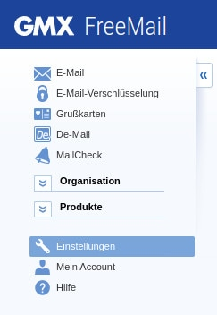

Die E-Mail-Dienste GMX und WEB.DE erfreuen sich im deutschsprachigen Raum großer Beliebtheit. Sie können GMX und WEB.DE Konten verwenden, um E-Mails aus einer SeaTable Bases heraus zu versenden.

Dieser Artikel erklärt, wie Sie ein **GMX** oder **WEB.DE** E-Mail-Konto in einer SeaTable Base einrichten und welche vorbereitenden Maßnahmen notwendig sind.



## POP3/IMAP Abruf erlauben

GMX und WEB.DE Konten können standardmäßig nur über die Webmailer oder die Apps der beiden Anbieter verwendet werden. Der Abruf und Versand von E-Mails mit einem Drittanbieterprogramm wie Outlook, Thunderbird und auch SeaTable muss explizit genehmigt werden. Dies machen Sie in den Einstellungen Ihres Kontos.

1. Loggen Sie sich in Ihr **GMX E-Mail-Konto** ein.
2. Rufen Sie die **Einstellungen** Ihres Kontos auf.

 4. Klicken Sie in den E-Mail-Einstellungen auf **POP3/IMAP Abruf**. 5. Aktivieren Sie **POP3 und IMAP Zugriff erlauben**.

 7. **Speichern** Sie Ihre Änderung.

Damit haben Sie alle Vorbereitungen getroffen, um dieses E-Mail-Konto in SeaTable für den Versand von E-Mails nutzen zu können.

## Anlage des E-Mail-Kontos in SeaTable

Nun fügen Sie Ihr E-Mail-Konto als **Drittanbieter** in Ihrer SeaTable Base hinzu. Dazu sind die folgenden Schritte notwendig:

1. Öffnen Sie die erweiterten Base-Optionen mit einem Klick auf das **drei Punkte-Icon** .
2. Wählen Sie die Option **Integration von Drittanbietern** aus.
3. Klicken Sie auf **E-Mail-Konto hinzufügen**.
4. Geben Sie die folgenden Informationen ein:
    - **Kontoname**: ein beliebiger Name für das Konto, z.B. 'GMX'
    - **Sender**: Ihre GMX Adresse, z.B. 'seatable@gmx.de'
    - **SMTP-Server**: 'mail.gmx.net'
    - **SMTP-Port**: '587'
    - **Benutzername**: Ihre GMX Adresse, z.B. 'seatable@gmx.de'
    - **Passwort**: das Passwort Ihres GMX Kontos

Die Felder IMAP-Host und IMAP-Port können leer bleiben. Die SMTP-Serverdaten für WEB.DE finden Sie im [Hilfebereich von WEB.DE](https://hilfe.web.de/pop-imap/imap/imap-serverdaten.html).

Eine Beispielkonfiguration für ein GMX Konto sieht so aus:

## E-Mails per Automation versenden

Danach können Sie das in Ihrer SeaTable Base angelegte E-Mail-Konto verwenden, um E-Mails per Automation oder [Schaltfläche]() zu verschicken.

Wenn Sie mehr über diese nützliche Automation erfahren wollen, lesen Sie den Artikel [E-Mail-Versand per Automation]().
