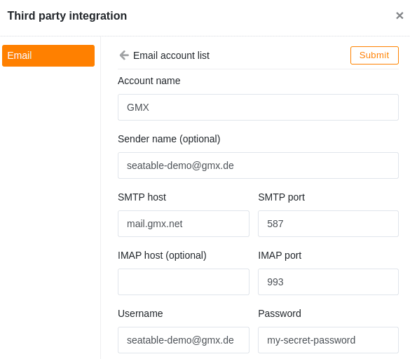

The email services GMX and WEB.DE are very popular in German-speaking countries. You can use GMX and WEB.DE accounts to send emails from a SeaTable Bases.

This article explains how to set up a **GMX** or **WEB.DE** e-mail account in a SeaTable Base and what preparatory measures are necessary.



## Allow POP3/IMAP retrieval

By default, GMX and WEB.DE accounts can only be used via the webmailers or apps of the two providers. The retrieval and sending of emails with a third-party program such as Outlook, Thunderbird and SeaTable must be explicitly approved. You can do this in your account settings.

1. Log in to your **GMX e-mail account**.
2. Call up the **settings** for your account.

4. Click on **POP3/IMAP retrieval** in the e-mail settings.
5. Activate **Allow POP3 and IMAP access**.

7. **Save** your change.

You have now made all the preparations to be able to use this email account in SeaTable for sending emails.

## Creation of the e-mail account in SeaTable

Now add your e-mail account as a **third-party provider** in your SeaTable Base. The following steps are necessary for this:

1. Open the extended base options by clicking on the **three-dot icon** .
2. Select the option **Integration of third-party providers**.
3. Click on **Add e-mail account**.

4. Enter the following information:
    - **Account name**: any name for the account, e.g. 'GMX'
    - **Sender**: Your GMX address, e.g. 'seatable@gmx.de'
    - **SMTP server**: 'mail.gmx.net'
    - **SMTP port**: '587'
    - **Username**: Your GMX address, e.g. 'seatable@gmx.de'
    - **Password**: the password of your GMX account

The IMAP host and IMAP port fields can remain empty. The SMTP server data for WEB.DE can be found in [the WEB.DE help section.](https://hilfe.web.de/pop-imap/imap/imap-serverdaten.html)

An example configuration for a GMX account looks like this:  

## Send emails via automation

After that, you can use the email account created in your SeaTable Base to send emails via automation or [button.]()

If you want to learn more about this useful automation, read the article [Email Sending by Automation]().
