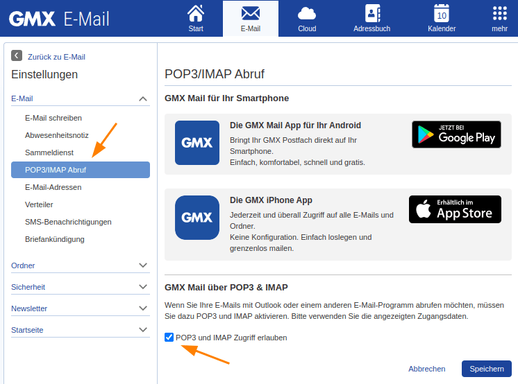

Los servicios de correo electrónico GMX y WEB.DE son muy populares en los países de habla alemana. Puede utilizar las cuentas GMX y WEB.DE para enviar correos electrónicos desde una SeaTable Bases.

Este artículo explica cómo configurar una cuenta de correo electrónico **GMX** o **WEB.DE** en una Base SeaTable y qué medidas preparatorias son necesarias.



## Permitir la recuperación POP3/IMAP

Por defecto, las cuentas GMX y WEB.DE sólo pueden utilizarse a través de los webmailers o apps de los dos proveedores. La recuperación y el envío de correos electrónicos con un programa de terceros como Outlook, Thunderbird y SeaTable deben aprobarse explícitamente. Puede hacerlo en la configuración de su cuenta.

1. Conéctese a su **cuenta de correo electrónico GMX**.
2. Acceda a la **configuración** de su cuenta.

4. Haga clic en **Recuperación POP3/IMAP** en la configuración de correo electrónico.
5. Active **Permitir acceso POP3 e IMAP**.

7. **Guarda** el cambio.

Ya ha realizado todos los preparativos para poder utilizar esta cuenta de correo electrónico en SeaTable para enviar correos electrónicos.

## Creación de la cuenta de correo electrónico en SeaTable

Ahora añada su cuenta de correo electrónico como **proveedor externo** en su Base SeaTable. Los siguientes pasos son necesarios para esto:

1. Abra las opciones de la base ampliada haciendo clic en el **icono de tres puntos**.
2. Seleccione la opción **Integración de proveedores externos**.
3. Haga clic en **Añadir cuenta de correo electrónico**.

4. Introduzca la siguiente información:
    - **Nombre de la** cuenta: cualquier nombre para la cuenta, por ejemplo "GMX".
    - **Remitente**: Su dirección GMX, por ejemplo "seatable@gmx.de".
    - **Servidor SMTP**: 'mail.gmx.net'
    - **Puerto SMTP**: '587
    - **Nombre de usuario**: Su dirección GMX, por ejemplo "seatable@gmx.de".
    - **Contraseña**: la contraseña de su cuenta GMX

Los campos host IMAP y puerto IMAP pueden permanecer vacíos. Los datos del servidor SMTP para WEB.DE se encuentran en [la sección de ayuda de WEB.DE.](https://hilfe.web.de/pop-imap/imap/imap-serverdaten.html)

Un ejemplo de configuración para una cuenta GMX es el siguiente:  

## Envío automatizado de correos electrónicos

A continuación, puede utilizar la cuenta de correo electrónico creada en su Base SeaTable para enviar correos electrónicos mediante automatización o [botón](https://seatable.io/es/docs/andere-spalten/eine-e-mail-per-schaltflaeche-verschicken/).

Si desea obtener más información sobre esta útil automatización, lea el artículo [Envío de correo electrónico mediante automatización](https://seatable.io/es/docs/beispiel-automationen/e-mail-versand-per-automation/).
