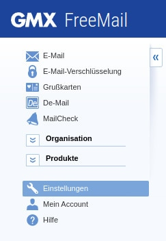
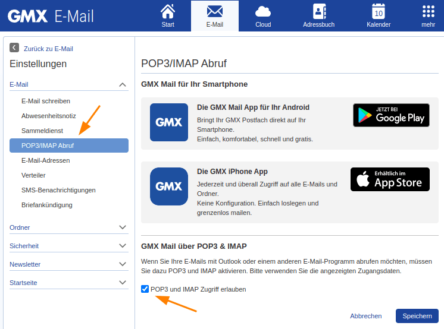
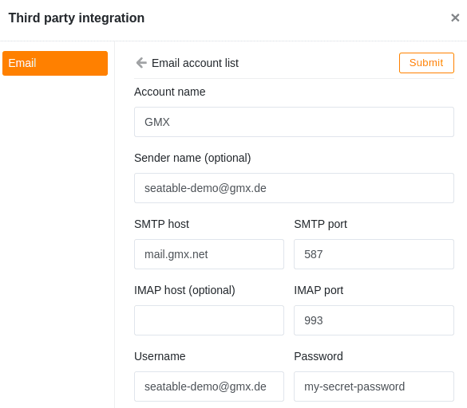

Почтовые сервисы GMX и WEB.DE очень популярны в немецкоговорящих странах. Вы можете использовать учетные записи GMX и WEB.DE для отправки электронных писем с базы SeaTable.

В этой статье рассказывается о том, как настроить учетную запись электронной почты **GMX** или **WEB.DE** на базе SeaTable Base и какие подготовительные меры необходимо предпринять.



## Разрешить получение POP3/IMAP

По умолчанию учетные записи GMX и WEB.DE можно использовать только через веб-почтовые программы или приложения этих двух провайдеров. Получение и отправка писем с помощью сторонних программ, таких как Outlook, Thunderbird или SeaTable, должны быть явно разрешены. Это можно сделать в настройках учетной записи.

1. Войдите в свою **учетную запись электронной почты GMX**.
2. Вызовите **настройки** вашей учетной записи.

4. В настройках электронной почты выберите пункт **Получение по POP3/IMAP**.
5. Активируйте **Разрешить доступ по протоколам POP3 и IMAP**.

7. **Сохраните** изменения.

Теперь вы сделали все приготовления, чтобы иметь возможность использовать эту учетную запись электронной почты в SeaTable для отправки писем.

## Создание учетной записи электронной почты в SeaTable

Теперь добавьте свою учетную запись электронной почты в качестве **стороннего провайдера** в базу SeaTable. Для этого необходимо выполнить следующие действия:

1. Откройте опции расширенной базы, нажав на **значок с тремя точками**.
2. Выберите опцию **Интеграция сторонних провайдеров.**
3. Нажмите на кнопку **Добавить учетную запись электронной почты**.

4. Введите следующую информацию:
    - **Имя счета**: любое название счета, например, 'GMX'.
    - **Отправитель**: Ваш адрес GMX, например, 'seatable@gmx.de'.
    - **SMTP-сервер**: 'mail.gmx.net'
    - **Порт SMTP**: '587'
    - **Имя пользователя**: ваш адрес GMX, например, 'seatable@gmx.de'.
    - **Пароль**: пароль вашей учетной записи GMX

Поля IMAP host и IMAP port могут оставаться пустыми. Данные SMTP-сервера для WEB.DE можно найти в [разделе справки по WEB.DE.](https://hilfe.web.de/pop-imap/imap/imap-serverdaten.html)

Пример конфигурации для учетной записи GMX выглядит следующим образом:  

## Отправка электронных писем с помощью автоматизации

Затем вы можете использовать учетную запись электронной почты, созданную в вашей базе SeaTable, для автоматической или [кнопочной]() отправки писем.

Если вы хотите узнать больше об этой полезной автоматизации, прочитайте статью [Рассылка электронной почты с помощью автоматизации]().
