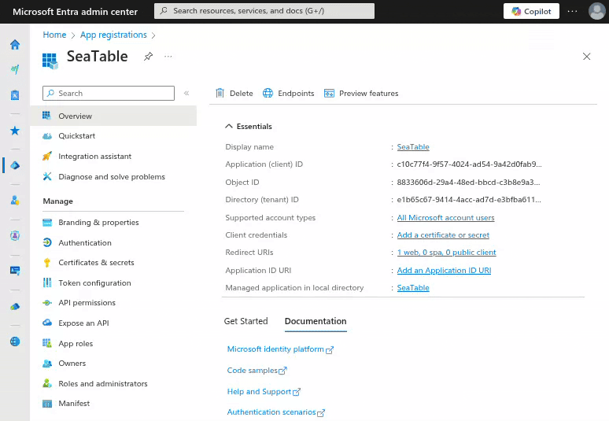
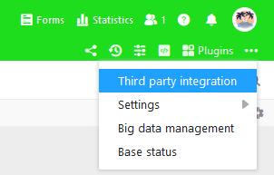
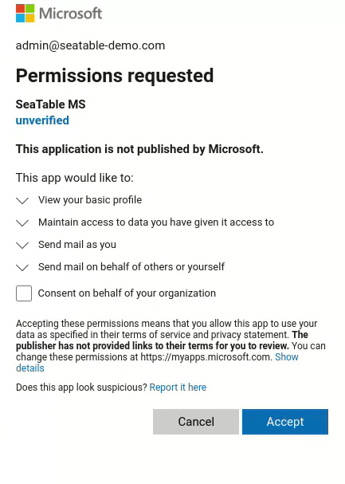

**Microsoft 365**, der beliebte Online-Dienst für Microsofts Office-Anwendungen, kann für den **Versand von E-Mails aus SeaTable** verwendet werden. Die Authentifizierung gegenüber Ihrem Microsoft 365 muss mittels Microsofts moderner Authentifizieung erfolgen. (Die Authentifizierung über Benutzername und Benutzer-Passwort ist bei Microsoft 365 nicht möglich.)



## Vorbereitung im Entra Admin Center

Um Ihren Microsoft 365 Account in SeaTable für den E-Mail Versand nutzen zu können, müssen Sie im Entra Admin Center von Microsoft zunächst eine Anwendung anlegen und konfigurieren.

1. Melden Sie sich am [Microsoft Entra Admin Center](https://entra.microsoft.com/) an. Der Benutzer braucht Admin-Rechte für das Konto, das für den Versand verwendet werden soll.
2. Klappen Sie die Rubrik **Anwendungen** in der Seitennavigation aus und klicken dann auf **App-Registrierungen**.
3. Erstellen sie eine neue Anmeldung durch Klick auf **\+ Neue Registrierung**. Geben Sie einen Namen ein (z.B. 'SeaTable') und wählen Sie "Konten in einem beliebigen Organisationsverzeichnis (beliebiger Microsoft Entra ID-Mandant – mandantenfähig) und persönliche Microsoft-Konten (z. B. Skype, Xbox)" als Kontotyp. Unter den Umleitungs-URI muss ein Eintrag mit Plattform "Web" und folgender URI angelegt werden:

    ```
    https://cloud.seatable.io/oauth/third-party-email-accounts/callback/
    ```

    Wenn Sie nicht SeaTable Cloud verwenden, dann ersetzen Sie cloud.seatable.io durch den Hostname Ihrer SeaTable Instanz. Schließen Sie die Anlage der App-Registrierung mit Klick auf "Registrieren" ab.

4. Notieren Sie die **Anwendungs-ID (Client)** auf der Übersichtsseite der gerade registrierten App. Diese wird für die Einrichtung des E-Mail-Kontos in SeaTable benötigt.
5. Klicken Sie in der Seitennavigation der App auf **Zertifikate und Geheimnisse**, um den Clientschlüssel zu erzeugen. Dies machen Sie im Tab **Geheime Clientschlüssel**. Vergeben Sie für den Schlüssel eine Beschreibung und ein "Gültig bis".

    

6. Kopieren Sie den Wert des erstellten Schlüssels in die Zwischenablage.

Damit haben Sie alle Vorbereitungen getroffen, um Ihren Microsoft 365 Account als E-Mail-Konto in SeaTable nutzen zu können.

## Anlage des Drittanbieterkontos in SeaTable

Nun müssen Sie Ihren Microsoft 365 Account in Ihrer SeaTable Base hinzufügen. Dazu sind die folgenden Schritte notwendig:



1. Öffnen Sie die erweiterten Base-Optionen mit einem Klick auf das **Drei-Punkte-Icon**  in der rechten oberen Ecke.
2. Wählen Sie die Option **Integration von Drittanbieter** aus.
3. Klicken Sie auf **E-Mail-Konto hinzufügen**.
4. Wählen Sie als Diensteanbieter **Outlook**.
5. Geben Sie die folgenden Informationen ein und klicken dann auf die "Abschicken" Schaltfläche in der rechten oberen Ecke:
    - **Kontoname**: Eine kurze Beschreibung des Kontos (z.B. 'Microsoft 365')
    - **Benutzername**: 'me'
    - **Client-ID**: die Anwendungs-ID (Client) der erstellten App
    - **Clientschlüssel**: der geheime Clientschlüssel der erstellten App
6. Bestätigen Sie die Erstellung des E-Mail-Kontos mit OAuth2 Authentifizierung.
7. Klicken Sie auf “Weiter”, wenn Sie darauf hingewiesen werden, dass diese App nicht überprüft wurde und erlauben Sie den Zugriff auf das Microsoft Konto.



## E-Mails per Automation oder Schaltfläche versenden

Danach können Sie das in Ihrer SeaTable Base angelegte E-Mail-Konto verwenden, um E-Mails per [Automation]() zu verschicken.

Wenn Sie mehr über diese nützliche Funktion erfahren wollen, lesen Sie den Artikel [Einrichtung eines E-Mail-Kontos in einer Base]().
