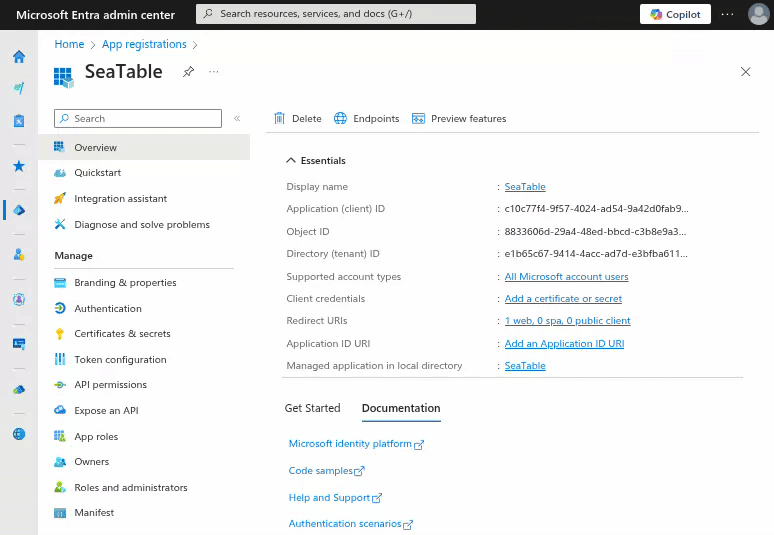

**Microsoft 365**, le service en ligne populaire pour les applications Microsoft Office, peut être utilisé pour **envoyer des e-mails depuis SeaTable**. L'authentification auprès de votre Microsoft 365 doit être effectuée à l'aide de l'authentification moderne de Microsoft. (L'authentification par nom d'utilisateur et mot de passe utilisateur n'est pas possible avec Microsoft 365).



## Préparation dans l'Entra Admin Center

Pour pouvoir utiliser votre compte Microsoft 365 dans SeaTable pour l'envoi d'e-mails, vous devez d'abord créer et configurer une application dans Entra Admin Center de Microsoft.

1. Connectez-vous au [Microsoft Entra Admin Center](https://entra.microsoft.com/). L'utilisateur doit avoir les droits admin pour le compte qui sera utilisé pour l'envoi.
2. Développez la rubrique **Applications** dans la navigation latérale, puis cliquez sur **Enregistrements d'applications**.
3. Créez une nouvelle inscription en cliquant sur le bouton "Inscription". **\+ Nouvel enregistrement**. Saisissez un nom (par ex. 'SeaTable') et sélectionnez "Comptes dans n'importe quel répertoire d'organisation (n'importe quel mandant Microsoft Entra ID - multi-tenant) et comptes personnels Microsoft (par ex. Skype, Xbox)" comme type de compte. Sous les URI de redirection, il faut créer une entrée avec la plate-forme "Web" et l'URI suivant :

    ```
    https://cloud.seatable.io/oauth/third-party-email-accounts/callback/
    ```

    Si vous n'utilisez pas SeaTable Cloud, remplacez cloud.seatable.io par le nom d'hôte de votre instance SeaTable. Terminez la création de l'enregistrement de l'application en cliquant sur "Enregistrer".

4. Notez l'**ID de l'application (client)** sur la page d'aperçu de l'application que vous venez d'enregistrer. Celui-ci est nécessaire pour la configuration du compte de messagerie dans SeaTable.
5. Dans la navigation latérale de l'application, cliquez sur **Certificats et secrets**pour générer la clé client. Vous le faites dans l'onglet **Clés client secrètes**. Attribuez à la clé une description et un "Valable jusqu'au".

    

6. Copiez la valeur de la clé créée dans le presse-papiers.

Vous avez ainsi effectué tous les préparatifs nécessaires pour pouvoir utiliser votre compte Microsoft 365 comme compte de messagerie dans SeaTable.

## Création du compte tiers dans SeaTable

Vous devez maintenant ajouter votre compte Microsoft 365 dans votre base SeaTable. Pour cela, il faut suivre les étapes suivantes :


1. Ouvrez les options avancées de la base en cliquant sur l'**icône à trois points**  dans le coin supérieur droit.
2. Sélectionnez l'option **Intégration de tiers**.
3. Cliquez sur **Ajouter un compte de messagerie**.
4. Sélectionnez **Outlook** comme fournisseur de services.
5. Saisissez les informations suivantes, puis cliquez sur le bouton "Envoyer" dans le coin supérieur droit :
    - **Nom du compte**: une brève description du compte (par ex. 'Microsoft 365')
    - **Nom d'utilisateur**: 'me
    - **ID client**: l'ID de l'application (client) de l'app créée
    - **Clé client**: la clé client secrète de l'application créée
6. Confirmez la création du compte e-mail avec l'authentification OAuth2.
7. Cliquez sur "Continuer" lorsqu'il vous est indiqué que cette application n'a pas été vérifiée et autorisez l'accès au compte Microsoft.


## Envoyer des e-mails par automatisation ou par bouton

Ensuite, vous pouvez utiliser le compte e-mail créé dans votre SeaTable Base pour envoyer des e-mails par [automatisation]().

Si vous souhaitez en savoir plus sur cette fonction utile, lisez l'article [Configuration d'un compte e-mail dans une base](https://seatable.io/fr/docs/arbeiten-mit-bases/einrichtung-eines-e-mail-kontos-in-einer-base/).
