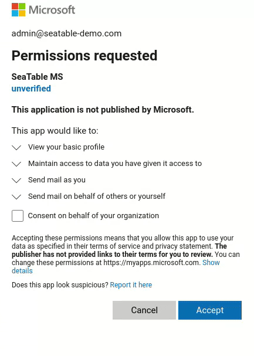

**O Microsoft 365**, o popular serviço online para as aplicações Office da Microsoft, pode ser utilizado para **enviar mensagens de correio eletrónico a partir do SeaTable**. A autenticação no seu Microsoft 365 deve ser efectuada utilizando a autenticação moderna da Microsoft. (A autenticação através do nome de utilizador e da palavra-passe do utilizador não é possível com o Microsoft 365).



## Preparação no Entra Admin Centre

Para poder utilizar a sua conta Microsoft 365 no SeaTable para enviar e-mails, deve primeiro criar e configurar uma aplicação no Entra Admin Centre da Microsoft.

1. Inicie sessão no [Microsoft Entra Admin Centre](https://entra.microsoft.com/). O utilizador necessita de direitos de administrador para a conta que será utilizada para o envio.
2. Expanda a secção **Aplicações** na navegação lateral e, em seguida, clique em **Registos de aplicações**.
3. Criar um novo início de sessão clicando em **\+ Novo registo**. Introduza um nome (por exemplo, "SeaTable") e selecione "Contas em qualquer diretório da organização (qualquer cliente Microsoft Entra ID - compatível com vários clientes) e contas pessoais Microsoft (por exemplo, Skype, Xbox)" como tipo de conta. Deve ser criada uma entrada com a plataforma "Web" e o seguinte URI no URI de redireccionamento:

    ```
    https://cloud.seatable.io/oauth/third-party-email-accounts/callback/
    ```

    Se não estiver a utilizar o SeaTable Cloud, substitua cloud.seatable.io pelo nome do anfitrião da sua instância do SeaTable. Conclua a criação do registo da aplicação clicando em "Registar".

4. Tome nota do **ID da aplicação (cliente)** na página de resumo da aplicação atualmente registada. Isto é necessário para configurar a conta de correio eletrónico no SeaTable.
5. Na navegação lateral da aplicação, clique em **Certificados e segredos**para gerar a chave do cliente. Isto é feito no separador **Chaves secretas de cliente**. Atribuir uma descrição e um "Válido até" à chave.

    

6. Copia o valor da chave criada para a área de transferência.

Já fez todos os preparativos para poder utilizar a sua conta Microsoft 365 como uma conta de correio electrónico no SeaTable.

## Criação da conta de terceiros no SeaTable

Agora é necessário adicionar a sua conta Microsoft 365 ao SeaTable Base. Para o fazer, são necessários os seguintes passos:


1. Abra as opções da base alargada clicando no **ícone de três pontos**  no canto superior direito.
2. Seleccionar a opção **Integração de Terceiros**.
3. Clique em **Adicionar conta de correio eletrónico**.
4. Selecione **Outlook** como o fornecedor de serviços.
5. Introduza as seguintes informações e, em seguida, clique no botão "Enviar" no canto superior direito:
    - **Nome da conta**: Uma breve descrição da conta (por exemplo, "Microsoft 365")
    - **Nome de utilizador**: "me".
    - **ID do cliente**: o ID da aplicação (cliente) da aplicação criada
    - **Chave de cliente**: a chave de cliente secreta da aplicação criada
6. Confirmar a criação da conta de correio eletrónico com autenticação OAuth2.
7. Clique em "Seguinte" quando for notificado de que esta aplicação não foi verificada e permita o acesso à conta Microsoft.



## Enviar e-mails através de automação ou botão

Pode então utilizar a conta de correio electrónico criada no seu SeaTable Base para enviar mensagens de correio electrónico através de [automação]().

Se quiser saber mais sobre esta funcionalidade útil, leia o artigo [Configurar uma conta de correio electrónico numa Base]().
