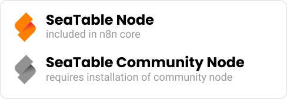

Com o  no n8n, pode integrar diretamente os seus dados SeaTable em fluxos de trabalho automatizados — sem scripts personalizados ou chamadas API. Desde a **versão 1.85.0**, o node SeaTable faz parte do **n8n Core** e suporta todas as funções essenciais para processar, atualizar ou ativar fluxos de trabalho com base em alterações nos dados do SeaTable.

## SeaTable no n8n Core

O node Core oferece todas as funções-chave para integrar o SeaTable no n8n:

- **Disparadores (Triggers):** inicie automaticamente fluxos de trabalho quando forem detectadas linhas novas ou modificadas numa tabela SeaTable.
- **Ações:** adicione registos, atualize entradas existentes ou elimine itens.

Isso permite-lhe usar o SeaTable diretamente como parte do seu ambiente de automação sem necessidade de instalações adicionais.

## Node SeaTable Community

Além da integração Core, os programadores e utilizadores avançados ainda dispõem do **node SeaTable Community**. Pode ser instalado diretamente no n8n como qualquer outro node Community — simplesmente através de _Settings → Community Nodes → Install_.

Desenvolvemos ativamente o node Community:

- As **novas funcionalidades** e **correções de erros** são primeiro implementadas lá.
- Depois de validadas, submetemos uma pull request para integrar essas alterações no node Core.

Assim, o node Community pode ser mais recente do que a versão Core — mas não tem de ser.



O código-fonte do node SeaTable Community está disponível no [GitHub](https://github.com/seatable/n8n-node). O [histórico de alterações (changelog)](https://github.com/seatable/n8n-node/blob/master/CHANGELOG.md) também está lá disponível.



## Utilização paralela

Ambos os nodes SeaTable — **Core** e **Community** — podem ser usados **em paralelo na mesma instância n8n**. Pode mesmo combiná-los num único fluxo de trabalho. Não existem **interações ou conflitos** entre estes nodes.

## Para quem é o node Community?

O node Community é ideal para utilizadores que:

- queiram experimentar funcionalidades novas antecipadamente,
- queiram beneficiar de correções de erros atuais antes de serem integradas oficialmente no Core,
- ou queiram contribuir ativamente para o desenvolvimento do node SeaTable.

## Conclusão

O **node SeaTable Core** oferece estabilidade e está totalmente integrado no n8n,  
enquanto o **node Community** traz inovação e melhorias precoces.  
Ambos podem ser usados em paralelo — com flexibilidade, compatibilidade e sem conflitos.
