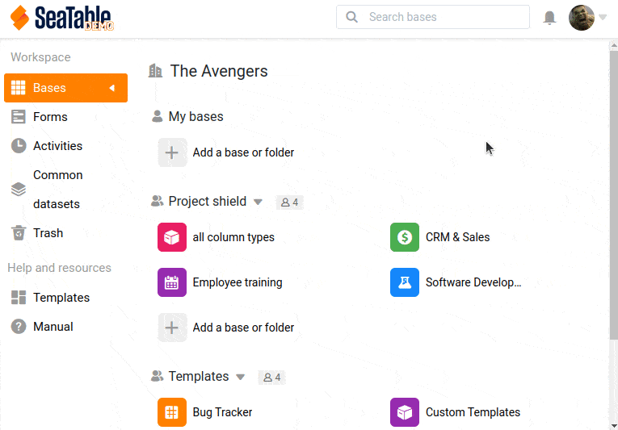

Für die Interaktion über die SeaTable-API mit einer Base muss zuerst ein sogenannter API-Token erzeugt werden. Ein API-Token erlaubt entweder lesenden oder schreibenden Zugriff auf genau eine Base.

Da beliebig viele API-Tokens für jede Base erzeugt werden können, empfiehlt es sich für jede Anwendung oder Schnittstelle einen eigenen Token zu erzeugen.



In SeaTable können Sie entweder über die Startseite oder als Team-Administrator über die Teamverwaltung Ihre API-Token erstellen.

## Erzeugen eines API-Token über die Startseite



API-Token können bequem auf der Startseite von SeaTable erzeugt werden.

1. Fahren Sie mit der Maus über die Base für die Sie einen Token erzeugen wollen.
2. Klicken Sie auf \[icon c="grey"\]dtable-icon-more-vertical\[/icon\]
3. Erweitern Sie den Abschnitt **Advanced** und wählen Sie **API-Token**.
4. Wählen Sie einen Namen und legen Sie die Berechtigung fest.
5. Erzeugen Sie Ihren neuen API-Token.

## Erzeugen eines API-Token über die Teamverwaltung



Als Team-Administrator können Sie für alle Bases, auf die Sie Zugriff haben, die API-Token zentral in der Teamverwaltung erstellen und bearbeiten.

1. Öffnen Sie in die Teamverwaltung
2. Wechseln Sie in den Bereich [API & Integrationen](https://account.seatable.io/api).
3. Klicken Sie auf API-Token erzeugen.
4. Wählen Sie einen Namen, die Base und die gewünschte Berechtigung.
5. Schicken Sie das Formular ab, um Ihren API-Token zu erzeugen.

## Gültigkeit der Token

Ein _API-Token_ hat kein Ablaufdatum und ist unlimitiert gültig. Behandeln Sie einen Base-Token wie ein Passwort.

Ein _Base-Token_ hat hingegen nur eine begrenzte Gültigkeit und muss immer wieder neu erzeugt werden.

## Einen Base-Token erzeugen

In der [SeaTable-API Dokumentation](https://api.seatable.io) finden Sie den notwendigen Befehl, um mit einem API-Token einen temporären Base-Token zu erzeugen.

Mit dem erzeugten Base-Token können Sie dann alle verfügbaren API-Endpunkte der _Base-Operations_ nutzen. Suchen Sie sich die passenden Endpunkte heraus und beginnen Sie mit der Entwicklung Ihrer eigenen App oder Schnittstelle.
