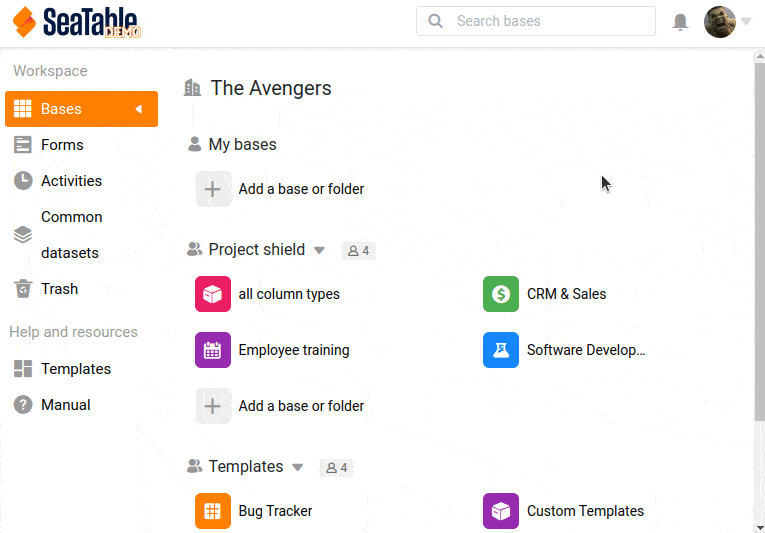
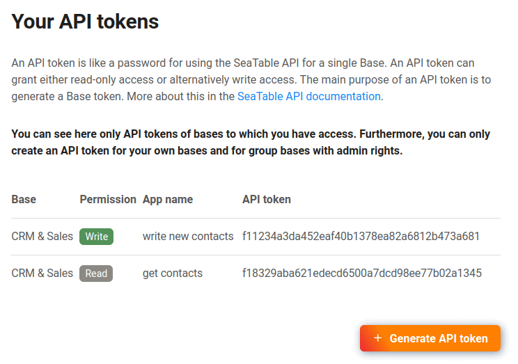

To interact with a base via the SeaTable API, a so-called API token must first be created. An API token allows either read or write access to exactly one base.

Since any number of API tokens can be created for each base, it is recommended to create a separate token for each application or interface.



In SeaTable, you can create your API tokens either from the home page or as a team administrator from the team administration.

## Generating an API token via the start page



API tokens can be conveniently created on the SeaTable home page.

1. Move the mouse over the base for which you want to create a token.
2. Click 
3. Expand the **Advanced** section and select **API Tokens**.
4. Choose a name and set the permission.
5. Generate your new API token.

## Generating an API token via team administration



As a team administrator, you can create and edit API tokens centrally in the team administration for all bases to which you have access.

1. Open the team administration.
2. Switch to the [API & Integrations](https://account.seatable.io/api) section.
3. Click Generate API Token.
4. Select a name, the base and the desired permission.
5. Submit the form to generate your API token.

## Validity of the tokens

An _API to_ ken has no expiration date and is valid indefinitely. Treat a base token like a password.

A _base token_, on the other hand, has only a limited validity and must be generated again and again.

## Create a base token

See the [SeaTable API documentation](https://api.seatable.com) for the command necessary to use an API token to create a temporary base token.

You can then use the generated base token to access all available API endpoints of the _Base-Operations_ use. Find the right endpoints and start developing your own app or interface.
