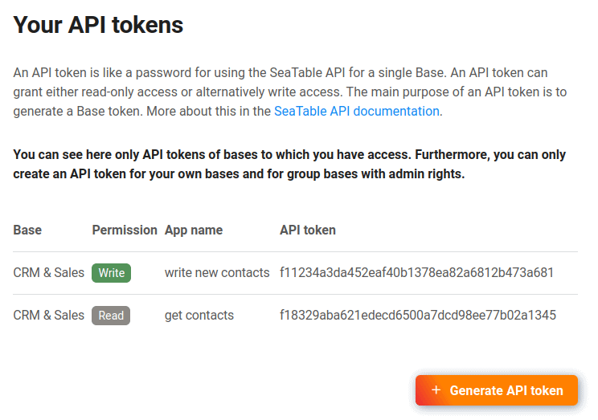

Чтобы взаимодействовать с базой через API SeaTable, сначала необходимо создать так называемый API-токен. API-токен позволяет получить доступ на чтение или запись только к одной базе.

Поскольку для каждой базы может быть создано любое количество API-токенов, рекомендуется создавать отдельный токен для каждого приложения или интерфейса.



В SeaTable вы можете создать свои API-токены либо на стартовой странице, либо как администратор команды через управление командой.

## Генерация токена API через стартовую страницу



API-токены можно удобно создать на главной странице SeaTable.

1. Наведите курсор мыши на базу, для которой вы хотите создать маркер.
2. Нажмите на 
3. Разверните раздел **Advanced** и выберите **API Tokens**.
4. Выберите имя и установите разрешение.
5. Создайте новый токен API.

## Генерация токена API через администрацию команды



Как администратор команды, вы можете создавать и редактировать API-токены централизованно в администрации команды для всех баз, к которым у вас есть доступ.

1. Откройте администрацию команды
2. Перейдите в раздел [API и интеграции](https://account.seatable.io/api).
3. Нажмите кнопку Generate API Token.
4. Выберите имя, базу и желаемую авторизацию.
5. Отправьте форму, чтобы сгенерировать токен API.

## Срок действия жетонов

_API-токен_ не имеет срока действия и действует неограниченное время. Обращайтесь с базовым токеном как с паролем.

_Базовый токен_, с другой стороны, имеет ограниченный срок действия и должен генерироваться снова и снова.

## Создание базового токена

В [документации по API SeaTable](https://api.seatable.io) вы найдете необходимую команду для создания временного базового токена с помощью API-токена.

Со сгенерированным базовым токеном можно использовать все доступные конечные точки API _Base-Operations_ использовать. Найдите подходящие конечные точки и начните разработку собственного приложения или интерфейса.
