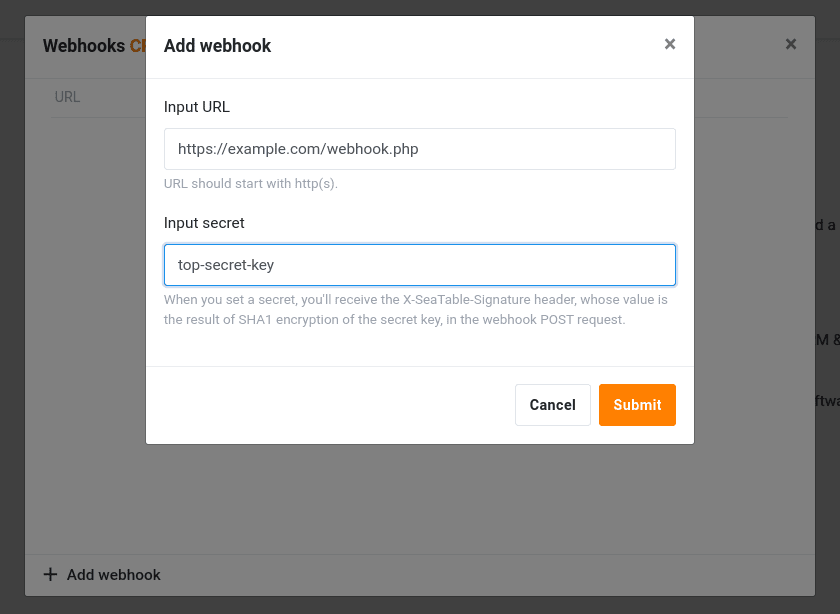

É sempre criado um gancho da web para uma base. Assim que o webhook é criado, cada alteração ao conteúdo da base é enviada para o URL de destino.



## Criar um gancho para a web

1. Na página inicial do SeaTable, flutue sobre uma base para a qual pretende criar um gancho para a web.
2. Clicar no item " _Webhooks"_ no menu de contexto em _Avançado_.
3. Introduzir um URL de destino e confirmar.
4. O gancho da rede torna-se activo imediatamente.

