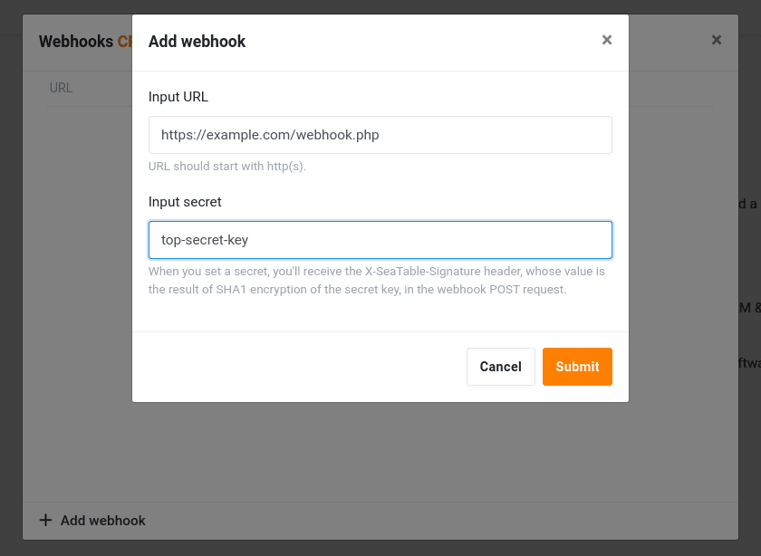

Для базы всегда создается веб-крючок. Как только веб-крючок настроен, каждое изменение содержимого базы отправляется на целевой URL.

## Настройте веб-крючок

1. На стартовой странице SeaTable наведите курсор на базу, для которой вы хотите установить веб-крючок.
2. Нажмите на пункт _Webhooks_ в контекстном меню в разделе _Advanced_.
3. Введите URL-адрес назначения и подтвердите.
4. Веб-крючок становится активным немедленно.

