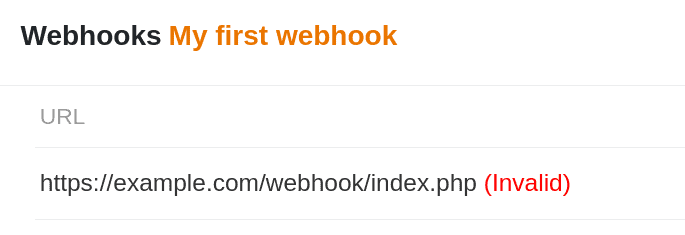

Si se configura un webhook para una Base SeaTable, SeaTable envía una _solicitud POST_ a la URL de destino cada vez que se realiza un cambio. Normalmente, el sistema receptor devuelve un mensaje de estado en forma de [código de estado de tres dígitos](https://en.wikipedia.org/wiki/List_of_HTTP_status_codes), que SeaTable procesa y desactiva el webhook si es necesario.

## Los códigos de estado HTTP más comunes

Existe toda una gama de códigos de estado, pero basta con conocer los más comunes:

- **200** - Con éxito
- **400** - Solicitud de baño
- **403** - Prohibido
- **500 - 511** - Errores del servidor

El código de estado más importante con diferencia es el 200, que indica que la solicitud se ha recibido y procesado correctamente.

## SeaTable desactiva los webhooks en caso de error

Cuando SeaTable envía un webhook, SeaTable espera una respuesta en forma de dicho código de estado HTTP. Si SeaTable no recibe un código de estado o un código de estado distinto de 200 cinco veces seguidas, el webhook se establece en estado _no válido_ y se interrumpe la ejecución.



## Reactivar un webhook inactivo

Un webhook inválido puede reactivarse en cualquier momento. Cambie a la edición del webhook inválido haciendo clic en  y guarde de nuevo el webhook sin realizar ningún cambio. El webhook volverá a estar activo inmediatamente.

Para evitar que se vuelvan a desactivar, el sistema receptor debe procesar los webhooks de forma fiable y devolver cada vez el código de estado 200.
