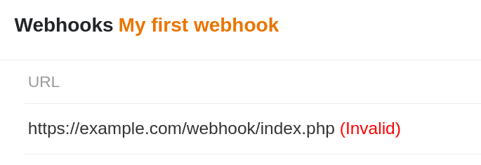

Si un webhook est configuré pour une Base SeaTable, SeaTable envoie une _requête POST_ à l'URL cible à chaque modification. Normalement, le système récepteur renvoie un message d'état sous la forme d'un [code d'état à trois chiffres](https://en.wikipedia.org/wiki/List_of_HTTP_status_codes), que SeaTable traite ensuite et désactive le webhook si nécessaire.

## Les codes d'état HTTP les plus courants

Il existe toute une série de codes de statut, mais il suffit de connaître les réactions les plus fréquentes :

- **200** - Successful
- **400** - Demande de bain
- **403** - Forbidden
- **500 - 511** - Erreurs de serveur

Le code d'état de loin le plus important est 200. Il indique que la demande a été reçue et traitée avec succès.

## SeaTable désactive les webhooks en cas d'erreur

Lorsque SeaTable envoie un webhook, il attend un retour sous la forme d'un code d'état HTTP. Si SeaTable ne reçoit pas de code d'état ou reçoit un code d'état autre que 200 cinq fois de suite, le webhook passe à l'état _invalide_ et son exécution est interrompue.



## Réactiver un webhook inactif

Un webhook non valide peut être réactivé à tout moment. Passez à l'édition du webhook non valide en cliquant sur  et enregistrez à nouveau le webhook sans effectuer de modification. Le webhook est alors immédiatement réactivé.

Pour éviter une nouvelle désactivation, le système récepteur doit traiter les webhooks de manière fiable et renvoyer à chaque fois le code d'état 200.
