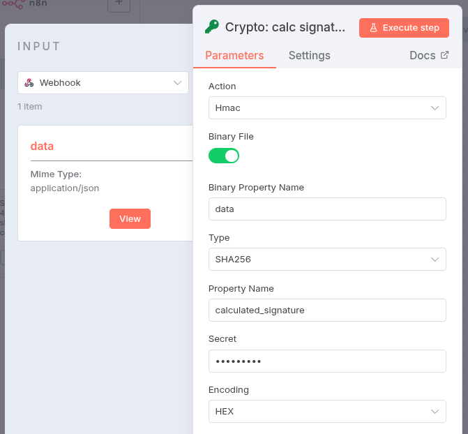
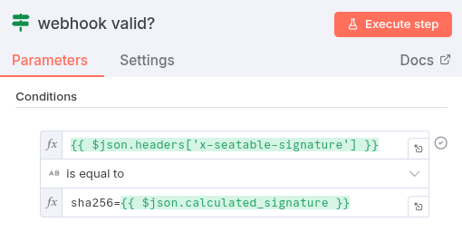

Um die Echtheit eingehender Webhooks aus SeaTable in n8n zu prüfen, wird jeder Request mit einer digitalen Signatur im Header `x-seatable-signature` versehen. Diese Signatur basiert auf dem gemeinsam konfigurierten geheimen Schlüssel (Webhook Secret) und dem Request-Body.

In n8n kannst du die Validierung folgendermaßen umsetzen:

1. Richte in deinem Workflow einen `Webhook-Trigger` ein. Aktiviere unbedingt die Option `Raw Body`.
2. Ergänze einen `Crypto Node`, in dem du den Request-Body sowie das Secret mit einem HMAC-SHA256-Algorithmus hashst und so die Signatur berechnest.

    

3. Vergleiche nun die vom Crypto Node berechnete Signatur mit dem Wert aus `x-seatable-signature`. Beachte, dass du noch `sha256=` zum berechneten Hash hinzufügst.

    

Nur wenn beide Werte übereinstimmen, gilt die Anfrage als authentisch.

So stellst du sicher, dass deine n8n-Workflows nur von SeaTable ausgelöste und unverfälschte Webhooks annehmen.
