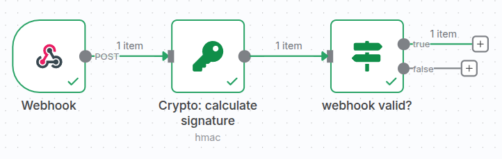
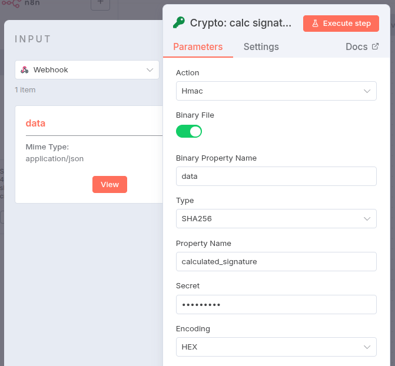
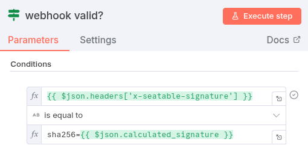

Para verificar a autenticidade dos webhooks recebidos do SeaTable no n8n, cada solicitação é enviada com uma assinatura digital no cabeçalho `x-seatable-signature`. Esta assinatura é baseada na chave secreta compartilhada (Webhook Secret) e no corpo da solicitação.

No n8n, você pode implementar a validação da seguinte forma:

1. Configure um `Webhook Trigger` no seu fluxo de trabalho. Certifique-se de ativar a opção `Raw Body`.
2. Adicione um `Crypto Node`, no qual você faz o hash do corpo da solicitação juntamente com a chave secreta utilizando o algoritmo HMAC-SHA256 para calcular a assinatura.

    

3. Compare então a assinatura calculada pelo Crypto Node com o valor de `x-seatable-signature`. Observe que você deve adicionar `sha256=` ao hash calculado.

    

A solicitação só é considerada autêntica se ambos os valores coincidirem.

Dessa forma, você garante que seus fluxos de trabalho no n8n aceitem apenas webhooks acionados pelo SeaTable e sem alterações.
