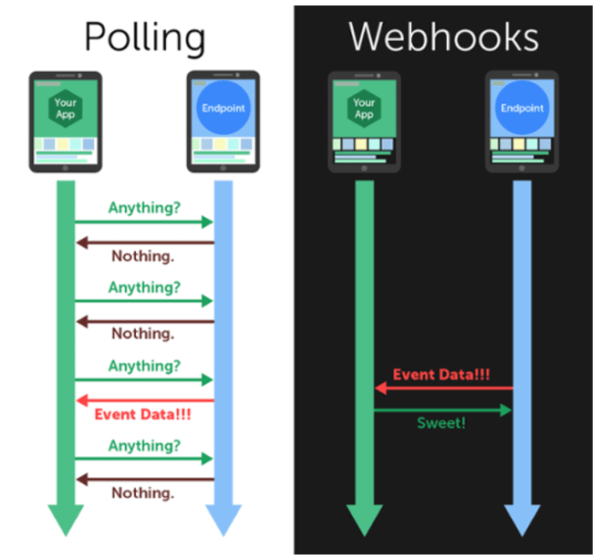



SeaTable offers the possibility to set up one or even more webhooks for a base. Once a webhook is set up, any change to the contents of a base triggers an impulse in the form of an HTTP post request to any URL.

Simplified, you can think of a webhook as a notification system. Every time something changes in a base, a record is sent to a URL you define.

- You add a new row: SeaTable sends you a message.
- You put a tick in a checkbox, that is also a message.
- You delete a row, who would have thought, this also generates a message.

Any change, no matter how small, to the contents of a base causes a webhook to be sent. This is why webhooks are often referred to as real-time notifications.



## Possible uses of webhooks

Along with REST APIs, webhooks are a popular method of allowing IT systems to talk to each other. In a way, a webhook is a kind of inverted API request. With the API, SeaTable waits for a request to come in, which is answered by the API. With a webhook, on the other hand, a notification is automatically sent when something happens.

Thus, you can use webhooks to ensure that certain changes are processed in another software. Typically, with webhooks, the event is sent to the destination URL in the form of a JSON or XML file. The URL is called the webhook endpoint.

Thus, webhooks basically work only in one direction. SeaTable tells another application that something has happened. It is thus the responsibility of the target application to decide whether this change is relevant and what follow-up activities should be triggered. Popular uses of webhooks include:

- Email or chat notification when a new row is created in a base.
- Automatic publication of an article as soon as the status is changed to "publish now".
- Updating a subscription as soon as a payment is recorded.

In terms of automation, webhooks are thus always the initiating trigger that leads to a desired follow-up activity.

## Advantages of webhooks

There are two ways in which different systems can communicate with each other to exchange information:

- Polling (a cyclic query to obtain information, events and value changes).
- Webhooks.

Polling requests information, resulting in a constant exchange even when no events occur at all.

Webhooks, on the other hand, only need to communicate when an event has occurred.
