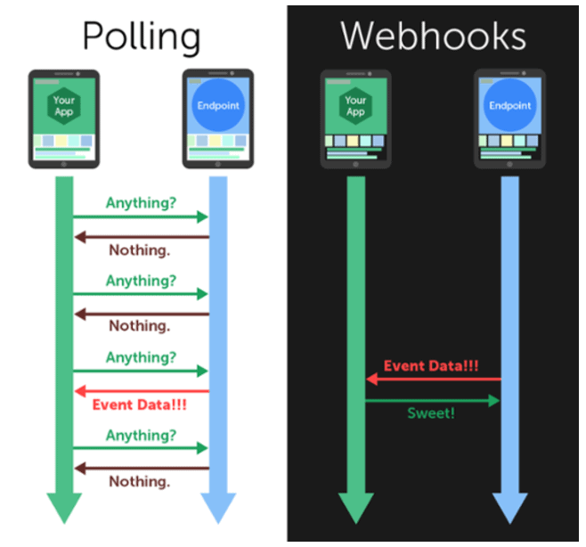



SeaTable offre la possibilité de configurer un ou même plusieurs webhooks pour une base. Une fois qu'un webhook est configuré, toute modification du contenu d'une base déclenche une impulsion sous la forme d'un HTTP Post Request vers n'importe quelle URL.

Pour simplifier, on peut se représenter un webhook comme un système de notification. Chaque fois que quelque chose change dans une base, un enregistrement est envoyé à une URL que vous avez définie.

- Vous ajoutez une nouvelle ligne : SeaTable vous envoie un message.
- Vous cochez une case, c'est aussi un message.
- Vous supprimez une ligne, qui l'eût cru, cela aussi génère un message.

Toute modification, même minime, du contenu d'une base entraîne l'envoi d'un webhook. C'est pourquoi on parle souvent de notification en temps réel pour les webhooks.



## Utilisations possibles des webhooks

Les webhooks sont, avec les API REST, une méthode populaire pour faire parler les systèmes informatiques entre eux. Un webhook est en quelque sorte une requête API inversée. Dans le cas d'une API, SeaTable attend une demande à laquelle l'API répond. Dans le cas d'un webhook, en revanche, une notification est automatiquement envoyée lorsque quelque chose se passe.

Ainsi, les webhooks permettent de faire en sorte que certaines modifications soient traitées dans un autre logiciel. Typiquement, avec les webhooks, l'événement est envoyé à l'URL cible sous la forme d'un fichier JSON ou XML. L'URL est appelée point final du webhook.

Les webhooks ne fonctionnent donc en principe que dans un sens. SeaTable informe une autre application que quelque chose s'est passé. C'est donc à l'application cible de décider si ce changement est pertinent et quelles actions de suivi doivent être déclenchées. Les utilisations les plus courantes des webhooks sont par exemple

- Notification par e-mail ou par chat dès qu'une nouvelle ligne est créée dans une base.
- Publication automatique d'un article dès que son statut passe à "publier maintenant".
- Mise à jour d'un abonnement dès qu'un paiement est saisi.

Dans l'optique d'une automatisation, les webhooks sont donc toujours le déclencheur qui conduit à une activité consécutive souhaitée.

## Avantages des webhooks

Il existe deux façons pour différents systèmes de communiquer entre eux afin d'échanger des informations :

- Polling (une interrogation cyclique pour obtenir des informations, des événements et des changements de valeur).
- Les webhooks.

Le polling consiste à demander des informations, ce qui entraîne un échange constant, même si aucun événement ne se produit.

En revanche, les webhooks ne doivent communiquer que lorsqu'un événement s'est produit.
