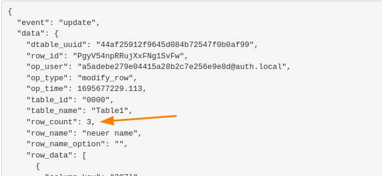

SeaTable suele enviar un webhook por cada cambio en una fila. Sin embargo, si un cambio en el editor web modifica varias filas al mismo tiempo, sólo se genera un webhook con el parámetro adicional _row_count_.

Este es el caso, por ejemplo, si introduce un valor con + al portapapeles y, a continuación, pulse + en otras líneas. Este proceso sólo generará un webhook. El siguiente gráfico muestra el webhook correspondiente.

Actualmente no existe la opción de crear un webhook distinto para cada línea.
