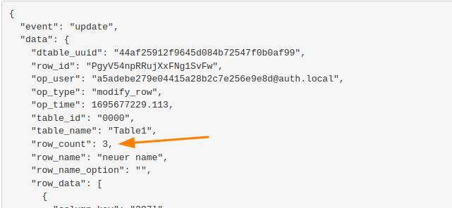

Обычно SeaTable отправляет веб-хук для каждого изменения строки. Однако если изменение в веб-редакторе изменяет несколько рядов одновременно, генерируется только один веб-хук с дополнительным параметром _row_count_.

Это происходит, например, если вы вводите значение с помощью + в буфер обмена, а затем нажмите кнопку + в нескольких других строках. В результате этого процесса будет сгенерирован только один веб-хук. На следующем графике показан соответствующий веб-хук.

В настоящее время нет возможности создать отдельный вебхук для каждой строки.
