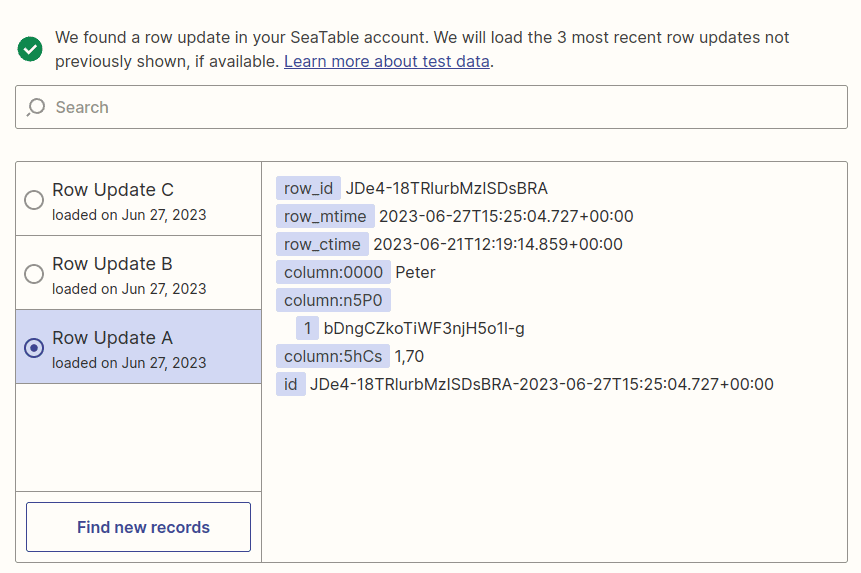

Zapier lets you create an interface between SeaTable and any of thousands of other apps in minutes. But even though Zapier is simple and intuitive to use, take a look at the following ways to get even more out of your Zaps.

## 1\. access linked table contents with lookup columns

SeaTable allows you to link records across two tables. For more details, see [this help article]().

Now there is a peculiarity: instead of displaying the desired value (in this case Marion) as in SeaTable, Zapier always returns the rows-ID of the linked entry for a link column. If you want to access the _Marion_ value or other columns of the linked entry, as shown here, you need to create [lookup columns]() that you can then use to access the desired values. Thus, in this example, you would need to create another lookup column with the name.

## 2\. execute the Zap when a date or time is reached.

Implementing this requirement is very simple if you know how. At this point, you take advantage of the fact that the SeaTable app in Zapier can be restricted to one view.

Create a [new view]() and define a filter for a date column that only displays entries where the value of the date column corresponds to, for example, today's date or a very specific date. If you define the filter accordingly, you can specify exactly when an entry appears in this view and thus triggers the Zap by selecting the date in the corresponding column.

## 3\. use formulas to avoid formatting in Zapier

Zapier offers various possibilities to edit data before the next processing step. For example, you can convert numbers to currencies or merge values, etc. You will get a short overview in this [article](https://zapier.com/blog/updates/593/introducing-formatter-by-zapier).

If your Zap reads the data from SeaTable, you should avoid such conversions in Zapier. Instead, use the possibilities provided by the [formula column]() in SeaTable. In SeaTable you can easily perform complex manipulations of your data and then use them in your Zap via the formula column.

## 4\. how not to exceed the API limit

Every serious API implementation limits the number of allowed calls to prevent individual users from blocking system resources or, in the worst case, bringing the entire system to its knees. SeaTable also uses such limits, although for Zapier probably only the limit of a maximum of 5,000 queries per day is relevant. This limit does not count per team or account, but is calculated per base. Exact details can be found in the [API documentation of SeaTable](https://api.seatable.com/reference/limits).

Basically, 5,000 views sounds like a pretty big number, but especially with a [Professional, Team or Company subscription to Zapier,](https://zapier.com/app/pricing) it can happen quickly that you reach this limit. The following example explains why this is the case:

With a team subscription, the Zap is executed every minute. With a trigger with SeaTable, that's already 1,440 calls per day. That is still a long way from 5,000, but perhaps you have set up an action with SeaTable in addition to the trigger. Or maybe you don't have one Zap, but two? Maybe you also create the public download links in the SeaTable trigger/action. All these settings lead to several requests being made to the SeaTable API per Zap run, which means that the API limit is reached comparatively quickly.



However, the API limits should not prevent you from subscribing to it. Because there are several simple ways to deal with the 429 error:

- Disable zaps that are no longer needed and access the same base.
- For example, disable Zaps outside your business hours [using this automation](https://zapier.com/apps/schedule/integrations/zapier-manager/23903/turn-off-a-zap-after-business-hours).
- Reduce the execution speed of your Zap if you have a [Company subscription](https://help.zapier.com/hc/en-us/articles/8495924437005-Can-I-control-when-my-Zap-runs-).
- Disable the generation of public download links for the column types image, file and digitial signature.
- Use a custom view for the Zap where you hide unneeded image, file, and signature columns.
- Check your zaps for unnecessary queries.

With these measures, you should have no trouble staying under the execution limit of 5,000 queries per day. If even this limit is not enough anymore, you can consider running your own [SeaTable server]() or booking a a [dedicated system](), where you can then increase the API limits accordingly.

## 5\. benefit from completely individual API requests

Using the SeaTable Zapier app you can easily monitor a base for new or changed entries, create new entries or update existing ones. With the _API-Request_ action you also have the possibility to execute any other API requests via Zapier, which might not be foreseen in the Zap. This action gives you the necessary freedom to execute any action from [Base Operations](https://api.seatable.com).



Use the option in the SeaTable API documentation to click together an API request and then apply the information. The following example shows the settings necessary to delete a row based on your rows ID.

This information will help you create the appropriate action in Zapier:

