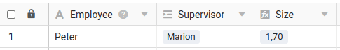
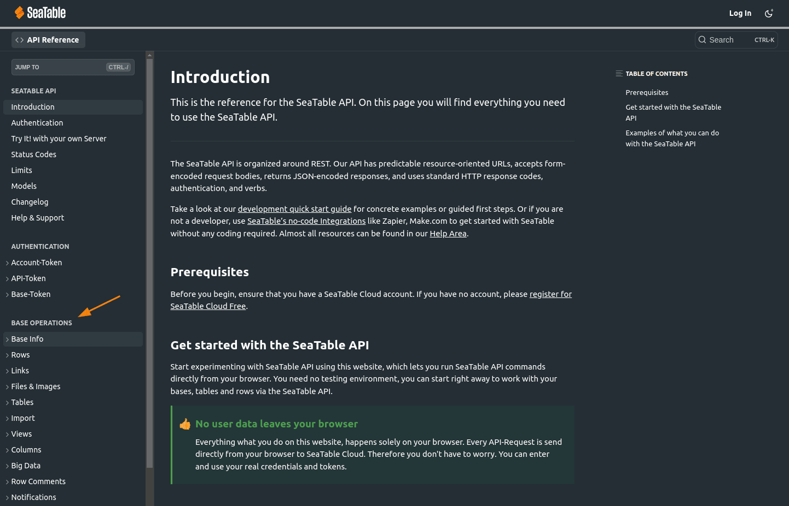
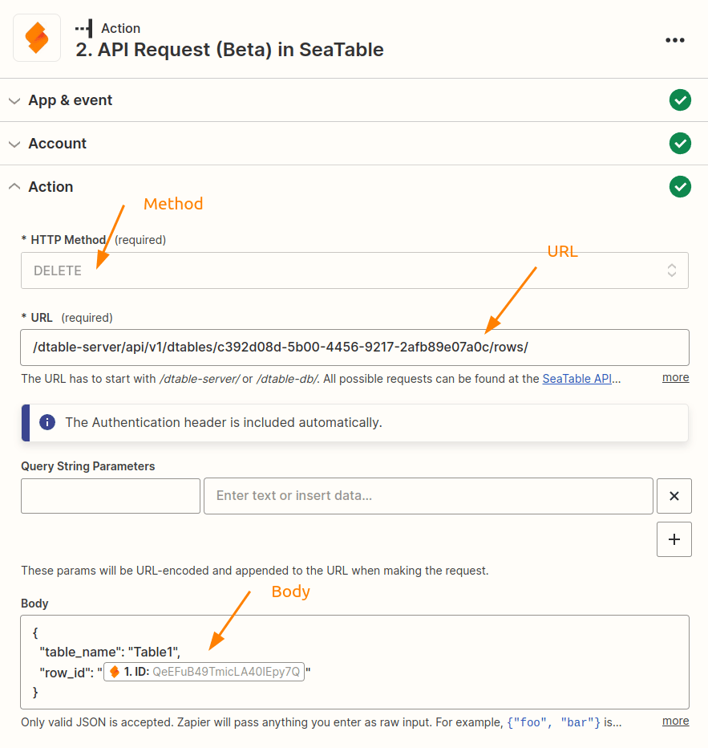

Zapier le permite crear una interfaz entre SeaTable y una de las miles de otras aplicaciones en tan sólo unos minutos. Pero aunque Zapier es fácil e intuitivo de usar, deberías echar un vistazo a las siguientes posibilidades para sacar aún más partido a tus Zaps.

## 1\. acceder al contenido de una tabla vinculada con columnas de búsqueda

SeaTable le permite enlazar registros entre dos tablas. Para más detalles, consulte [este artículo de ayuda]().

Ahora hay una característica especial: en lugar de mostrar el valor deseado (en este caso Marion) como en SeaTable, Zapier siempre proporciona el ID de fila de la entrada vinculada para una columna de enlace. Si desea acceder al valor _Marion_ u otras columnas de la entrada vinculada como se muestra aquí, tiene que crear [columnas de búsqueda](https://seatable.io/es/docs/verknuepfungen/die-lookup-funktion/) a través de las cuales puede acceder a los valores deseados. En este ejemplo, tendría que crear otra columna de consulta con el nombre.

## 2\. ejecutar el Zap cuando se alcance una fecha u hora.

Es muy fácil implementar este requisito si sabes cómo. En este punto, aprovecha que la app SeaTable en Zapier puede limitarse a una vista.

Cree una [nueva]() vista y defina un filtro para una columna de fecha que sólo muestre las entradas en las que el valor de la columna de fecha corresponda, por ejemplo, a la fecha de hoy o a una fecha muy especial. Si define el filtro en consecuencia, podrá determinar exactamente cuándo aparece una entrada en esta vista y, por tanto, activa el toque seleccionando la fecha en la columna correspondiente.

## 3\. utilizar fórmulas para evitar el formato en Zapier

Zapier ofrece varias posibilidades para editar datos antes del siguiente paso de procesamiento. Por ejemplo, puede convertir números en divisas o fusionar valores, etc. Puedes obtener una breve descripción general en este [artículo](https://zapier.com/blog/updates/593/introducing-formatter-by-zapier).

Si su Zap lee los datos de SeaTable, debería prescindir de tales conversiones en Zapier. En su lugar, utilice las posibilidades que ofrece la [columna]() de fórmulas en SeaTable. En SeaTable puedes hacer fácilmente manipulaciones complejas de tus datos y luego usarlas en tu Zap a través de la columna de fórmulas.

## 4\. cómo no superar el límite API

Toda implementación seria de API limita el número de llamadas permitidas para evitar que usuarios individuales bloqueen los recursos del sistema o, en el peor de los casos, pongan de rodillas a todo el sistema. SeaTable también utiliza este tipo de límites, aunque para Zapier sólo es relevante el límite de un máximo de 5.000 consultas al día. Este límite no cuenta por equipo o cuenta, sino que se calcula por base. Puedes encontrar más detalles en la [documentación de la API de Sea](https://api.seatable.com/reference/limits)Table.

Básicamente, 5.000 visitas parece un número bastante grande, pero especialmente con una [suscripción Profesional, Equipo o Empresa a Zapier,](https://zapier.com/app/pricing) puede ocurrir rápidamente que alcances este límite. El siguiente ejemplo explica por qué ocurre esto:

Con una suscripción de equipo, el Zap se ejecuta cada minuto. Con un disparador con SeaTable, ya son 1.440 llamadas al día. Todavía está lejos de las 5.000, pero quizás haya configurado una acción con SeaTable además del activador. ¿O tal vez no tiene un Zap, sino dos? Tal vez también cree los enlaces de descarga pública en el activador/acción de SeaTable. Todas estas configuraciones llevan a que se realicen varias peticiones a la API de SeaTable por cada ejecución de Zap, lo que significa que el límite de la API se alcanza comparativamente rápido.



Sin embargo, los límites de la API no deberían impedirle suscribirse. Porque hay varias formas sencillas de solucionar el error 429:

- Desactiva los zaps que ya no sean necesarios y que accedan a la misma base.
- Por ejemplo, desactive los Zaps fuera de su horario comercial [utilizando esta automatización](https://zapier.com/apps/schedule/integrations/zapier-manager/23903/turn-off-a-zap-after-business-hours).
- Reduzca la velocidad de ejecución de su Zap si tiene una [suscripción de Empresa](https://help.zapier.com/hc/en-us/articles/8495924437005-Can-I-control-when-my-Zap-runs-).
- Desactivar la generación de enlaces de descarga públicos para los tipos de columna imagen, archivo y firma digital.
- Utilice una vista separada para el Zap en la que oculte las columnas innecesarias de imagen, archivo y firma.
- Compruebe si hay consultas innecesarias.

Con estas medidas, no debería tener dificultades para mantenerse por debajo del límite de ejecución de 5.000 consultas al día. Si incluso este límite ya no es suficiente, puede considerar la posibilidad de ejecutar su propio [servidor SeaTable]() o reservar un [sistema dedicado]() en el que podrá aumentar los límites de la API en consecuencia.

## 5\. beneficiarse de solicitudes API completamente individuales

Con la aplicación Zapier de SeaTable, puede supervisar fácilmente una base en busca de entradas nuevas o modificadas, crear nuevas entradas o actualizar las existentes. Con la acción _API-Request_, también tiene la opción de ejecutar cualquier otra solicitud API a través de Zapier que pueda no estar prevista en el Zap. Esta acción te da la libertad necesaria para ejecutar cualquier acción desde el área de [Operaciones Base](https://api.seatable.com).



Utilice la opción de la documentación de la API de SeaTable para hacer clic junto a una solicitud de API y, a continuación, aplicar la información. El siguiente ejemplo muestra la configuración necesaria para eliminar una fila basada en su ID de fila.

Esta información le ayudará a crear la acción adecuada en Zapier:

