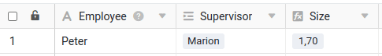
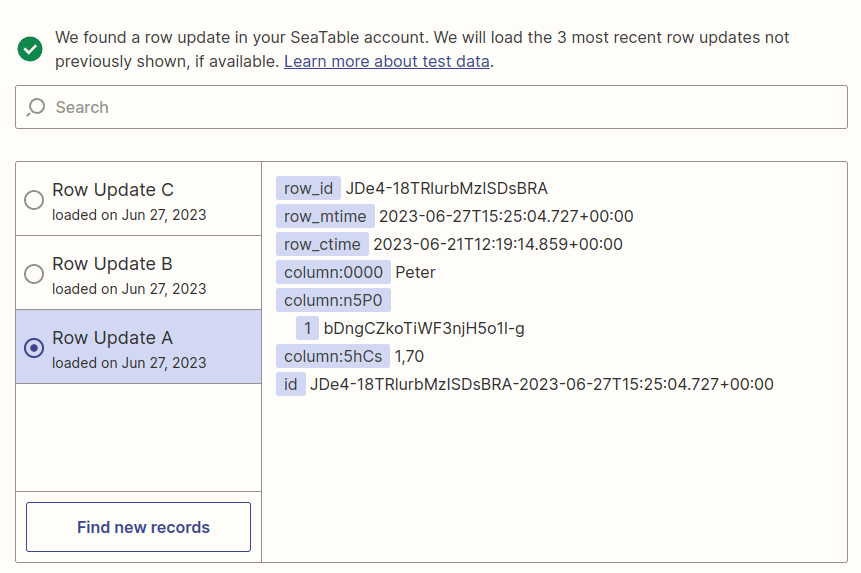
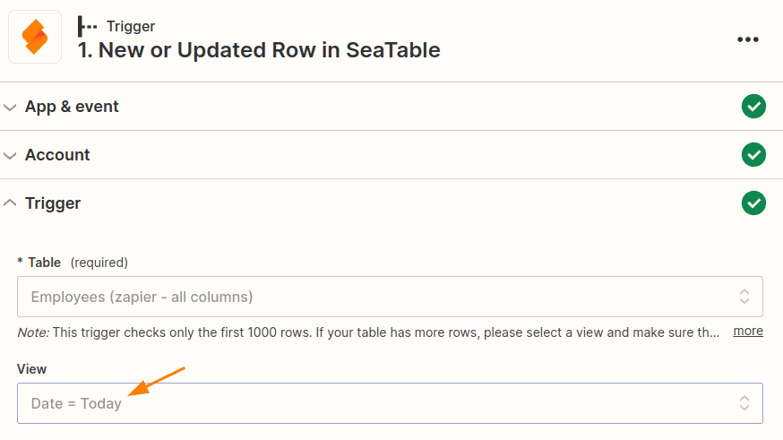
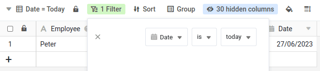
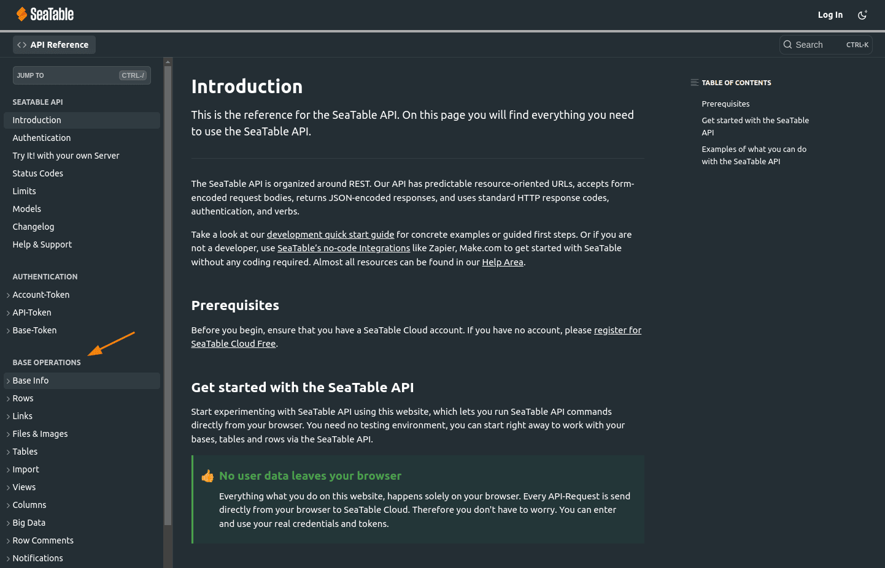
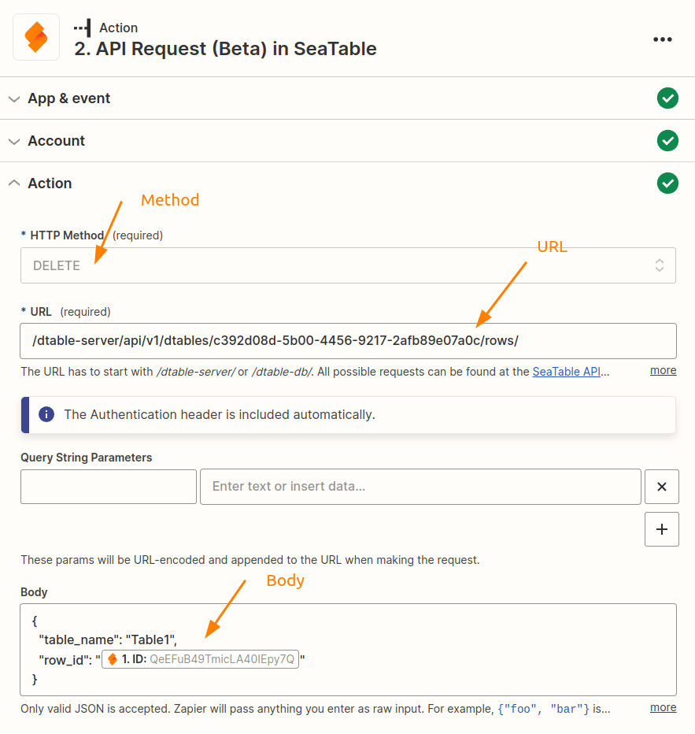

Zapier vous permet de créer en quelques minutes une interface entre SeaTable et l'une des milliers d'autres applications. Mais même si Zapier est facile et intuitif à utiliser, vous devriez jeter un coup d'œil aux possibilités suivantes pour tirer encore plus de vos Zaps.

## 1. accéder au contenu des tableaux liés à l'aide de colonnes de consultation

SeaTable permet de relier des enregistrements entre eux sur deux tableaux. Pour plus de détails, consultez [cet article d'aide]().

Il y a maintenant une particularité : au lieu d'afficher la valeur souhaitée (dans ce cas Marion) comme dans SeaTable, Zapier fournit toujours l'ID de ligne de l'entrée liée pour une colonne de lien. Si vous souhaitez accéder à la valeur Marion ou à d'autres colonnes de l'entrée liée, comme illustré ici, vous devez créer [des colonnes de consultation]() qui vous permettent ensuite d'accéder aux valeurs souhaitées. Dans cet exemple, il faudrait donc créer une autre colonne de lookup avec le nom.

## 2. exécution du zap lorsqu'une date ou une heure est atteinte

Il est très facile de répondre à cette exigence si l'on sait comment s'y prendre. Vous profitez ici de la possibilité de limiter l'application SeaTable à une seule vue dans Zapier.

Créez une [nouvelle vue]() et définissez un filtre pour une colonne de date, qui n'affichera que les entrées pour lesquelles la valeur de la colonne de date correspond par exemple à la date du jour ou à une date très particulière. Si vous définissez le filtre en conséquence, vous pouvez, en choisissant la date dans la colonne correspondante, déterminer exactement quand une entrée apparaît dans cette vue et déclenche ainsi le zap.

## 3. utiliser des formules pour éviter le formatage dans Zapier

Zapier offre diverses possibilités pour traiter les données avant l'étape de traitement suivante. Vous pouvez par exemple convertir des chiffres en devises ou fusionner des valeurs, etc. Vous trouverez un bref aperçu dans cet [article](https://zapier.com/blog/updates/593/introducing-formatter-by-zapier).

Si les données de votre Zap sont lues à partir de SeaTable, vous devriez renoncer à de telles conversions dans Zapier. Utilisez plutôt les possibilités offertes par la [colonne de formules]() de SeaTable. Dans SeaTable, vous pouvez sans difficulté effectuer des manipulations complexes de vos données et les utiliser ensuite dans votre Zap via la colonne des formules.

## 4. comment ne pas dépasser la limite de l'API

Toute implémentation d'API sérieuse limite le nombre d'appels autorisés afin d'éviter que certains utilisateurs ne bloquent les ressources du système ou, dans le pire des cas, ne mettent tout le système à genoux. SeaTable utilise également de telles limites, mais pour Zapier, seule la limite de 5.000 requêtes par jour est pertinente. Cette limite ne compte pas par équipe ou par compte, mais est calculée par base. Vous trouverez des détails précis dans [la documentation API de SeaTable](https://api.seatable.com/reference/limits).

En principe, 5.000 vues semblent être un nombre sacrément élevé, mais il peut vite arriver que l'on atteigne cette limite, en particulier avec [un abonnement professionnel, d'équipe ou de société à Zapier](https://zapier.com/app/pricing). L'exemple de calcul suivant explique pourquoi il en est ainsi :

Avec un abonnement d'équipe, le zap est exécuté toutes les minutes. Avec un déclencheur avec SeaTable, cela fait donc déjà 1 440 vues par jour. C'est encore loin des 5.000, mais il se peut qu'en plus du trigger, on ait encore mis en place une action avec SeaTable. Ou alors on n'a pas un zap, mais deux ? Peut-être crée-t-on aussi les liens de téléchargement publics dans le déclencheur/action SeaTable. Tous ces paramètres font que plusieurs requêtes sont envoyées à l'API SeaTable par exécution de zap et que l'on atteint ainsi relativement vite la limite de l'API.



es limites de l'API ne doivent toutefois pas vous empêcher de souscrire un abonnement correspondant. En effet, il existe plusieurs moyens simples de contourner l'erreur 429 :

- Désactiver les zaps qui ne sont plus nécessaires et qui accèdent à la même base.
- Désactivez Zaps, par exemple en dehors de vos heures de bureau, [à l'aide de cette automatisation](https://zapier.com/apps/schedule/integrations/zapier-manager/23903/turn-off-a-zap-after-business-hours).
- Réduisez la vitesse d'exécution de votre zap si vous avez un [abonnement Company](<(https://help.zapier.com/hc/en-us/articles/8495924437005-Can-I-control-when-my-Zap-runs-)>).
- Désactiver la génération des liens de téléchargement publics pour les types de colonnes Image, Fichier et Signature numérique.
- Utilisez une vue spécifique pour le zap, dans laquelle vous masquez les colonnes d'images, de fichiers et de signatures inutiles.
- Vérifier que vos zaps ne contiennent pas de requêtes inutiles.

Avec ces mesures, vous ne devriez pas avoir de difficultés à rester en dessous de la limite d'exécution de 5.000 requêtes par jour. Si même cette limite ne suffit plus, vous pouvez envisager d'exploiter votre propre [serveur SeaTable]() ou de réserver un [système dédié](), pour lequel vous pourrez ensuite augmenter les limites API en conséquence.

## 5. profiter de requêtes API entièrement personnalisées

L'application Zapier de SeaTable vous permet de surveiller facilement les nouvelles entrées ou les entrées modifiées dans une base, de créer de nouvelles entrées ou de mettre à jour les entrées existantes. Avec l'action API-Request, vous avez en outre la possibilité d'exécuter par Zapier d'autres requêtes API qui ne sont peut-être pas prévues dans Zap. Cette action vous donne la liberté d'exécuter n'importe quelle action du domaine [Base Operations](https://api.seatable.com).



Utilisez la possibilité offerte par la documentation de l'API SeaTable pour cliquer sur une requête API et reprendre ensuite les informations. L'exemple suivant montre les paramètres nécessaires pour supprimer une ligne en fonction de votre ID de ligne.

Ces informations vous aideront à créer l'action appropriée dans Zapier :

