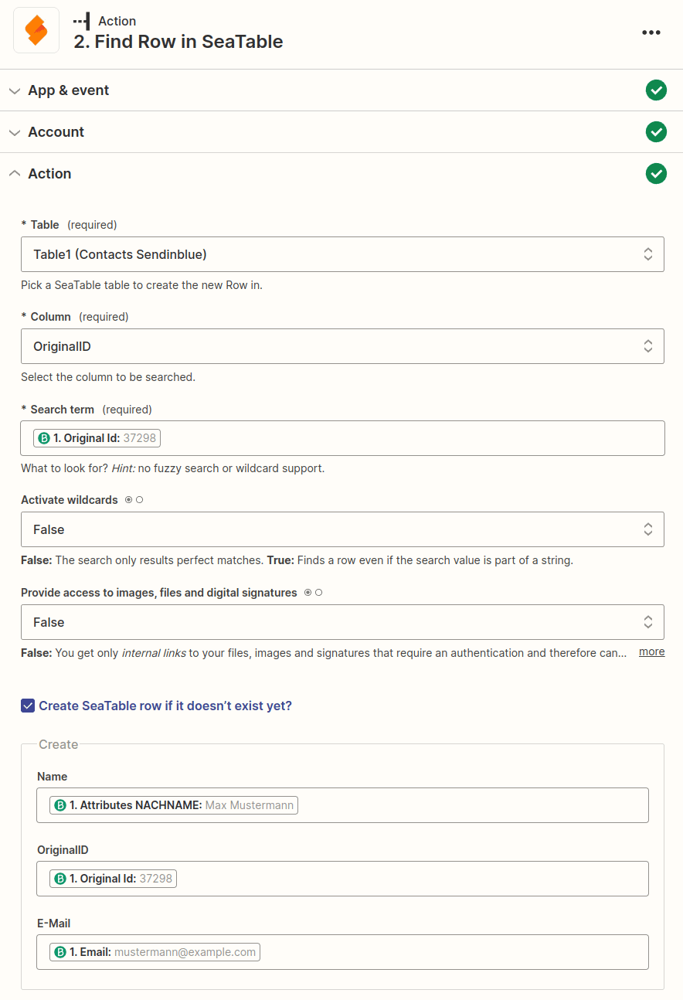
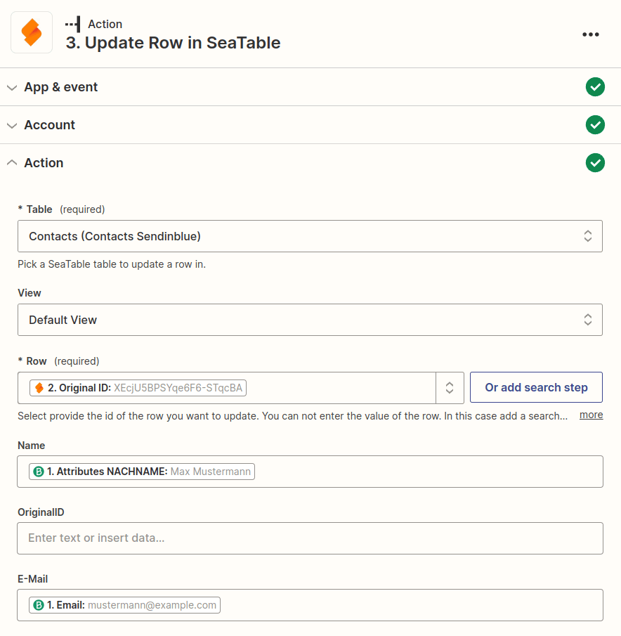

Zapier ist der führende Anbieter von No-Code-Automatisierung und lässt sich in mehr als 5.000 Anwendungen von Partnern wie Google, Salesforce und Microsoft integrieren. In diesem Artikel erfahren Sie, wie Sie einen mehrstufigen Zap entwerfen, um eine Integration zu erstellen, die die Aktualisierung von existierenden SeaTable-Einträgen automatisiert. Hierzu wird eine Suche in Zapier verwendet, um die gewünschten Einträge in SeaTable zu identifizieren, um sie dann entsprechend zu aktualisieren.



## Beispiel: Automatische Aktualisierung von Kontakten aus Brevo

Stellen Sie sich vor, Sie nutzen Brevo (ehemals SendinBlue) zum Managen Ihrer Kundenbeziehungen und folglich sind alle Ihre Kundenkontaktdaten in Brevo gespeichert. In diesem Beispiel sollen nun mithilfe von Zapier die Kontaktdaten von Brevo zu Sendinblue übertragen werden. D.h. wenn neue Kontakte in Brevo erstellt werden, sollen diese auch in SeaTable angelegt werden, gleichzeitig sollen aber auch bei Änderungen an existierenden Kontakten in Brevo die entsprechenden Einträge in SeaTable aktualisiert werden.

Diese Anforderung lässt sich durch eine zwischengeschaltete Suche im Zap realisieren, wobei Sie in diesem Hilfeartikel erfahren werden, wie das genau funktioniert.

### Anlage der SeaTable Base zum Speichern der Kontakte

Damit wir die Kontakte von Brevo zu Seatable schicken können, benötigen wir eine passende Base. Um das Beispiel so einfach wie möglich zu halten, erstellen wir eine minimale Base mit nur drei Spalten.

- Name
- OriginalID
- E-Mail

Die Namen der Spalten sind grundsätzlich egal, wichtig ist jedoch, dass wir eine Spalte haben, in der ein Wert gespeichert wird, die den Benutzer eindeutig identifiziert. Bei Brevo ist das die OriginalID, welche sich nicht verändert. Diesen Wert nutzen wir im Zap bei der Suche, um einen Kontakt eindeutig zu identifizieren.

### Jede Kontaktanlage oder Kontaktanpassung triggert den Zap

Brevo bietet eine Zapier App mit dem Event _New or Updated Contact in Brevo_. Dieser Trigger ist ideal, weil er sowohl bei neuen Kontakten als auch Änderungen reagiert. Die folgende Grafik zeigt die Rückgabewerte eines testweise angelegten Kunden.

### Die Suche nach dem Kontakt mit Hilfe der OriginalID

Die zweite Aktion des Zaps ist nun das _Find Row_. Mit diesem Event kann man gezielt in einer Spalte nach einem Wert suchen. Wie oben bereits angekündigt, nutzen wir die OriginalID, um nach dem Kontakt zu suchen. Nun gibt es zwei Möglichkeiten: entweder wird kein Eintrag gefunden, was bedeutet das es sich um einen neuen Kontakt handelt und dieser angelegt werden muss.

Die zweite Möglichkeit ist, dass ein Eintrag gefunden wird, was bedeutet, dass kein neuer Eintrag angelegt werden muss und wir stattdessen die _ID der Zeile_ des Kontakts in SeaTable erhalten. Mit dieser eindeutigen ID können wir dann im dritten Schritt den existierenden Kontakt aktualisieren.

### Aktualisierung des Kontakts

Sollte der Zap im zweiten Schritt einen Eintrag finden, wird im dritten Schritt der bereits existierende Kontakt aktualisiert. Hierzu wird eine Action mit dem Event _Update Row_ verwendet. Durch die eindeutige Zeilen-ID aus Schritt 2 wird festgelegt, welcher Eintrag aktualisiert werden soll, wobei in diesem Beispiel nur der Name und die E-Mailadresse aktualisiert wird.

Selbstverständlich können noch viel mehr Informationen aus Brevo nach SeaTable kopiert werden. Dieses Beispiel diente nur der Verdeutlichung, wie man durch einen Suchschritt die Aktualisierung existierenden Einträge erreichen kann.
